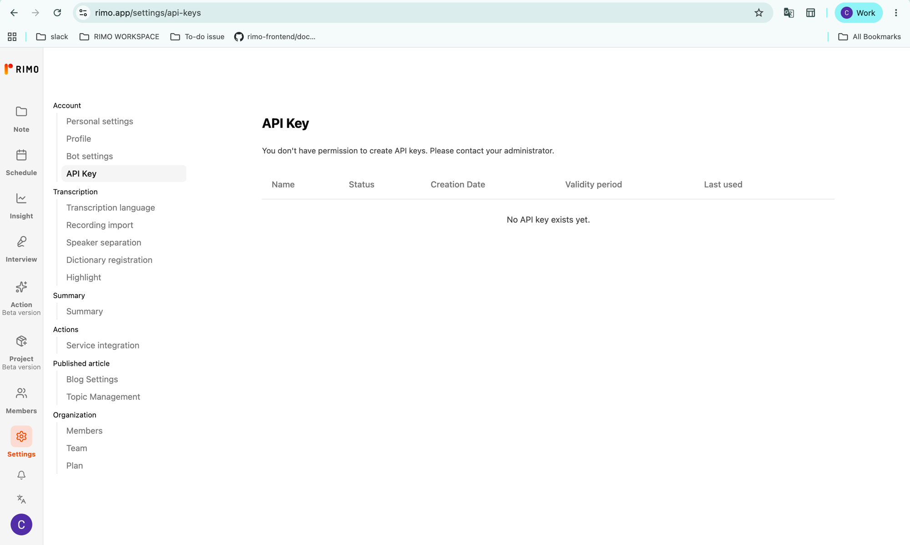
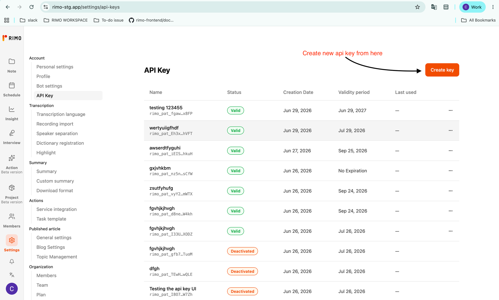
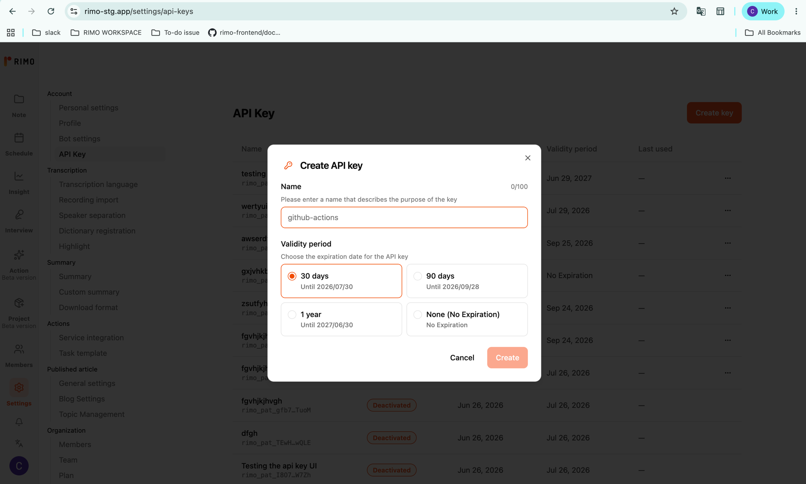
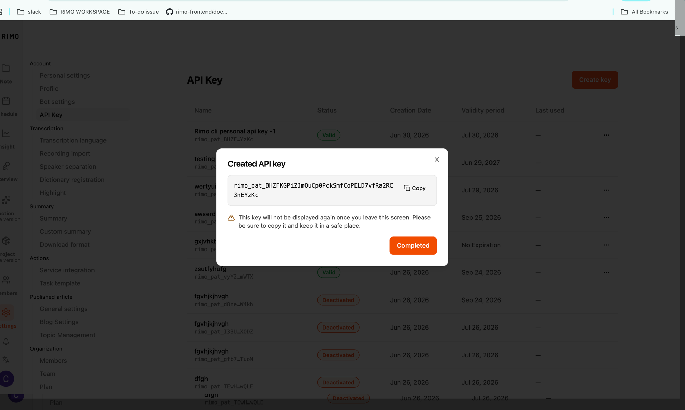
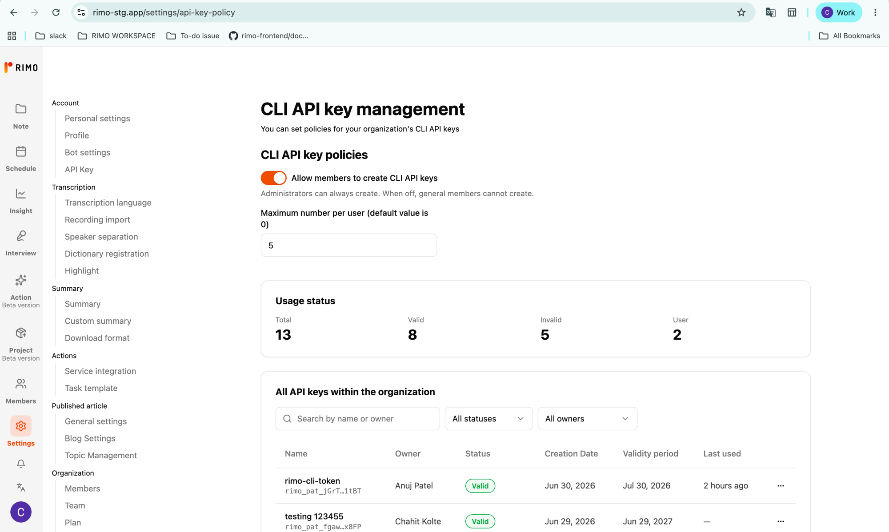
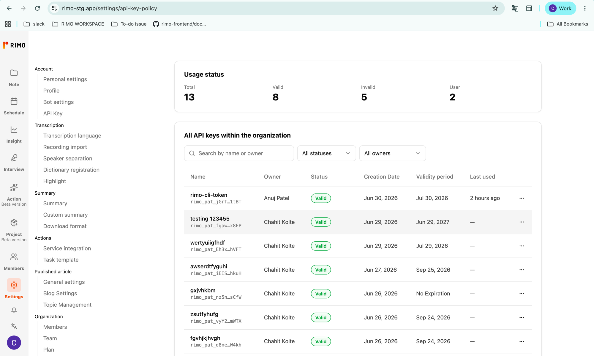
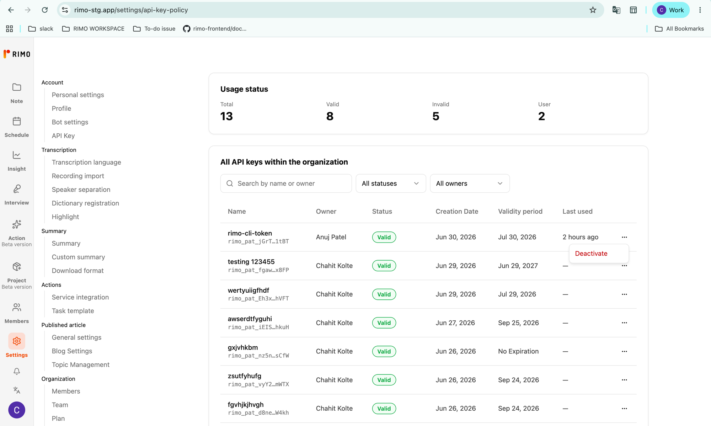

# API keys

[English](../en/personal-api-keys.md) | [日本語](../ja/personal-api-keys.md)

A **personal API key** lets `rimo` authenticate **without a browser login** — ideal for CI/CD pipelines, scripts, and scheduled jobs. You create the key once in the Rimo web app, then hand it to the CLI through the `RIMO_API_KEY` environment variable.

For everyday interactive use on your own machine, use [`rimo auth login`](authentication.md) instead. API keys are meant for automation, where no human is there to open a browser.

This guide covers:

- **[Creating a key](#creating-a-key)** — generate one in the Rimo web app.
- **[Using the key with the CLI](#using-the-key-with-the-cli)** — set `RIMO_API_KEY`.
- **[Managing your keys](#managing-your-keys)** — view, track, and deactivate.
- **[Administrator settings](#administrator-settings)** — enable the feature and oversee keys org-wide.

## Before you start

Personal API keys are **off by default** for an organization. Before anyone can create one, an **organization administrator must enable them** (see [Administrator settings](#administrator-settings)).

Until it's enabled, the **API Key** page shows *"You don't have permission to create API keys. Please contact your administrator."* and there is no **Create key** button. Ask your administrator to turn the feature on (see [Administrator settings](#administrator-settings)).



## Creating a key

Keys are created in the Rimo web app, not from the CLI.

### 1. Open the API Key page

In the Rimo web app, go to **Settings → API Key** (`rimo.app/settings/api-keys`).



### 2. Create a key

1. Click **Create key**.
2. Enter a **Name** that describes what the key is for — for example, `github-actions`. (It's just a label; it doesn't affect what the key can do.)
3. Choose a **Validity period**:
   - **30 days**
   - **90 days**
   - **1 year**
   - **None (No Expiration)** — the key stays valid until you deactivate it by hand. Use this only when you really need it; a key that never expires is riskier if it ever leaks.
4. Click **Create**.



### 3. Copy the key — it's shown only once

After creation, Rimo displays the key **one time only**. It starts with `rimo_pat_`.

1. Click **Copy**.
2. Paste it somewhere safe — a password manager, or your automation tool's secret store (see [Using the key with the CLI](#using-the-key-with-the-cli)). **Never** paste it into chat, email, or a file that gets committed to source control.
3. Click **Completed** to close the dialog.

> ⚠️ **Once you leave this screen, the key can never be shown again.** If you lose it, you can't recover it — just deactivate it and create a new one.



## Using the key with the CLI

`rimo` reads the key from the `RIMO_API_KEY` environment variable. Set it to the value you copied (the `rimo_pat_…` string):

```bash
export RIMO_API_KEY="rimo_pat_xxxxxxxxxxxxxxxxxxxxxxxxxxxxxxxxxxxxxxxxxxxx"

rimo note list        # works immediately — no `rimo auth login` needed
```

In a CI/CD system (GitHub Actions, GitLab CI, etc.), add `RIMO_API_KEY` as an encrypted **secret** rather than hard-coding it. For example, in GitHub Actions:

```yaml
- run: rimo note search "Q3 release plan"
  env:
    RIMO_API_KEY: ${{ secrets.RIMO_API_KEY }}
```

A few things worth knowing:

- **`RIMO_API_KEY` takes priority** over a browser login on the same machine. When it is set, `rimo` uses it and ignores the account from `rimo auth login`. Unset it to fall back to your logged-in account.
- An invalid or malformed key **fails fast** with a clear error, before any network call.
- See [Authentication](authentication.md) for the full token-resolution order and how interactive login compares.

## Managing your keys

The **API Key** page lists every key you've created. For each one you can see:

- **Name**
- **Status** — see the values below
- **Creation Date**
- **Validity period** — the expiration date, or *No Expiration*
- **Last used** — when the key last authenticated a request (a dash `—` if never used)

Status values:

| Status | Meaning |
|--------|---------|
| **Valid** | Active and usable. |
| **N days remaining** | Valid, but expiring soon (within 14 days). |
| **Expired** | Past its validity period; no longer works. |
| **Deactivated** | Manually switched off; no longer works. |

### Deactivate a key

If a key is no longer needed — or you suspect it has leaked — deactivate it:

1. Click the **⋯** (three-dots) menu on the key's row.
2. Choose **Deactivate** and confirm.

> ⚠️ Deactivating is **immediate and permanent** — any automation using that key stops working right away, and it cannot be reactivated. Create a new key if you need one again.

## Administrator settings

As an organization administrator you decide **whether** members can create keys, **how many** each may have, and you can **oversee and shut off** any key in the organization.

Open **Settings → CLI API key management** (`rimo.app/settings/api-key-policy`). This page is visible to administrators only.



### Allow members to create keys

The feature is **off by default**.

- Turn on **Allow members to create CLI API keys** to let regular members create their own.
- Administrators can always create keys, regardless of this setting. When it's off, regular members cannot.

### Limit how many keys each member can have

Set **Maximum number per user (default value is 0)**.

- **0** uses the platform default.
- Any other whole number caps how many keys a single member may hold. When a member hits the limit, they're told to deactivate an unused key or ask you to raise the cap.

### Monitor and deactivate any key

- **Usage status** shows org-wide totals: **Total**, **Valid**, **Invalid**, and the number of **User**s with keys.
- **All API keys within the organization** is a searchable, filterable table showing each key's **Name**, **Owner**, **Status**, **Creation Date**, **Validity period**, and **Last used**. Search by name or owner, or filter by status or owner.



To shut off any key — for example, if it may be compromised or belongs to someone who has left — open the **⋯** menu on that row and choose **Deactivate**. As with self-service, this is immediate and cannot be undone.



## Troubleshooting

| What you see | What it means / what to do |
|--------------|----------------------------|
| **"API Key" page or Create button is missing** | Your admin hasn't enabled the feature, or your account isn't allowed to create keys. Ask your administrator. |
| **You've reached the API key limit** | You already hold the maximum number allowed. Deactivate an unused key, or ask your admin to raise the per-user limit. |
| **The CLI reports an authentication error** | Check that `RIMO_API_KEY` is set correctly and the key hasn't **expired** or been **deactivated**. Run `rimo auth status` to see how the CLI is resolving credentials. |
| **You lost the key** | Keys can't be recovered after creation. Deactivate the old one and create a new key. |

## Security notes

- Treat an API key like a password — anyone who has it can act as you in Rimo.
- Store keys only in secret managers / CI secrets, never in chat, email, or committed code.
- Prefer a validity period over **No Expiration** unless you have a specific reason.
- If a key might have leaked, deactivate it immediately and create a replacement.
