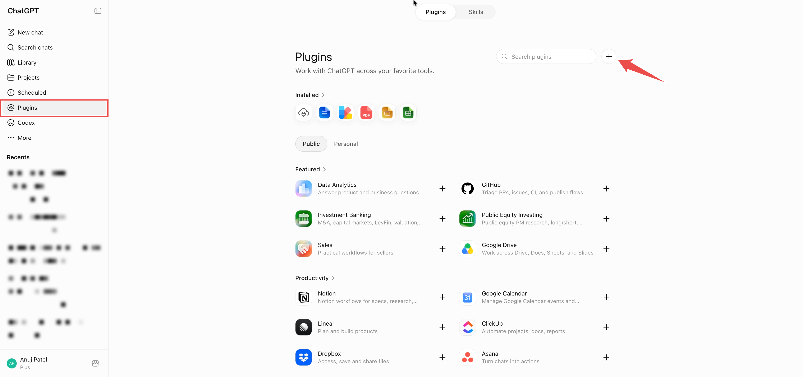
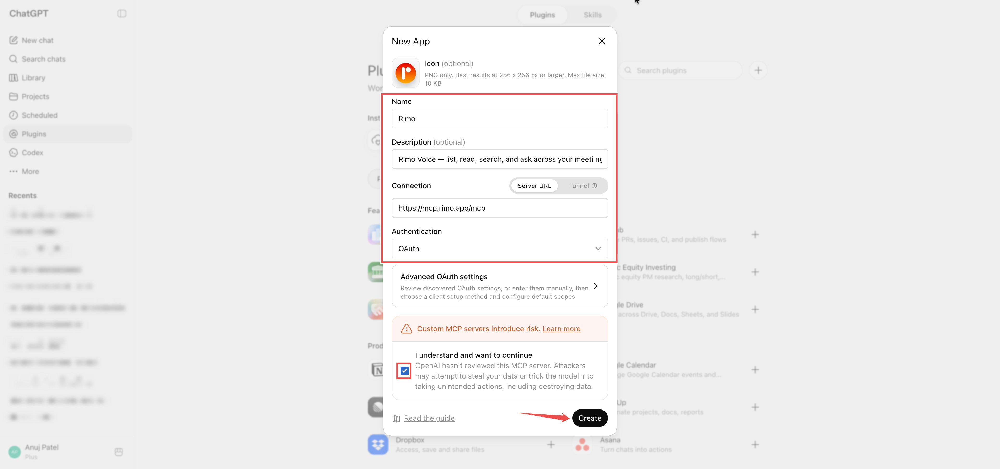
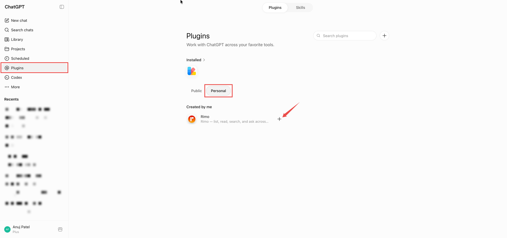
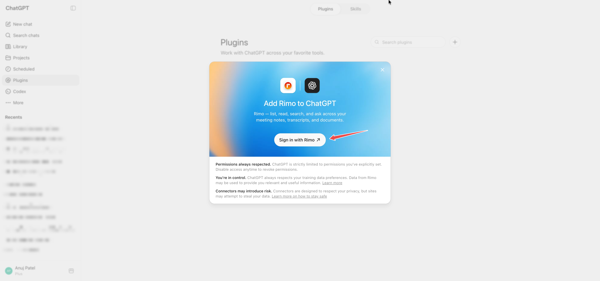
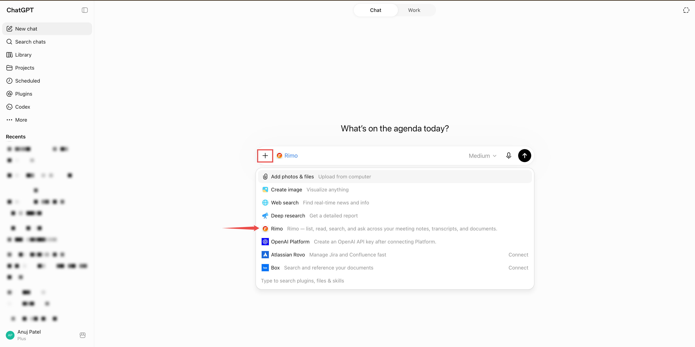

# Rimo in ChatGPT

[English](../en/rimo-in-chatgpt.md) | [日本語](../ja/rimo-in-chatgpt.md)

Connect Rimo to **ChatGPT** and ask about your meeting notes right inside the chat. ChatGPT looks things up in Rimo and answers:

- *"What did we decide in Monday's call, according to my Rimo notes?"*
- *"Summarise last week's client meeting from Rimo."*

There is **nothing to install**. You add one link in ChatGPT, sign in with your usual Rimo account in your browser, and you're done.

**The link to add:**

```
https://mcp.rimo.app/mcp
```

> Using Claude or Microsoft Copilot instead? See [Rimo in Claude](rimo-in-claude.md) or [Rimo in Microsoft Copilot](rimo-in-microsoft.md). On your own machine with a coding tool (Claude Code, Cursor, Codex)? See [Rimo in Coding Tools](setup-guide.md).

---

## Before you start

- A **Rimo account** — the same one you normally sign in with, in a team / organization.
- A ChatGPT account **on the web**, on a plan that supports custom MCP plugins:
  - **Plus / Pro** — you turn on Developer mode yourself.
  - **Business / Enterprise / Education** — an administrator turns on custom connectors for the workspace first; then each member turns on Developer mode.

You never type a Rimo password or key into ChatGPT. You sign in on Rimo's own page, in your browser.

---

## Turn on Developer mode

Custom MCP plugins live behind **Developer mode**, so it must stay **on** — if you turn it off, Rimo stops working in chat. It's a simple on/off toggle; you don't write any code.

### Plus / Pro — turn it on yourself

1. In ChatGPT, open **Settings → Security and login**.
2. Turn **Developer mode** on.

### Business / Enterprise / Education — an admin enables it first

1. An **administrator** turns on custom connectors for the whole workspace, under **Workspace Settings → Permissions & Roles → Connected Data → Developer mode / Create custom MCP connectors**.
2. Each member then turns on **Developer mode** for themselves, under **Settings → Security and login → Developer mode**.

---

## Add the Rimo plugin

1. Open **Settings → Plugins** (or go to [chatgpt.com/plugins](https://chatgpt.com/plugins)).
2. Click the **+** at the top right.

   

3. In the **New App** dialog, fill in:
   - **Name:** `Rimo`
   - **Description:** `Rimo Voice — list, read, search, and ask across your meeting notes, transcripts, and documents.`
   - **Connection:** keep **Server URL** and enter `https://mcp.rimo.app/mcp`
   - **Authentication:** **OAuth** (you can leave **Advanced OAuth settings** as they are)
   - Tick **I understand and want to continue**.

   

4. Click **Create**. The Rimo plugin now appears under **Plugins → Personal → Created by me**.

---

## Sign in to Rimo

1. Under **Plugins → Personal → Created by me**, click the **+** next to **Rimo** to add it.

   

2. On the **Add Rimo to ChatGPT** screen, click **Sign in with Rimo**. ChatGPT opens a browser window on Rimo's own sign-in page.

   

3. **Sign in to Rimo** with your usual account.
4. **Pick an organization and approve.** The screen shows that ChatGPT is asking for access and asks which **organization** it may look at. Choose one — the **Approve** button stays greyed out until you do — then click **Approve**. (**Deny** cancels.)

> You won't need to do this again unless you remove the plugin.

---

## Use it in a chat

1. Start a new conversation.
2. Click the **+** button near the message box.
3. Pick **Rimo** from the menu.

   

4. Ask, e.g. *"Search my Rimo notes for the pricing discussion and tell me what we decided."*

---

## Codex

**Codex** — OpenAI's coding agent in the ChatGPT sidebar — connects to the same hosted Rimo server, but you add it as an **MCP server** rather than a plugin. **Developer mode** still has to be on (see [Turn on Developer mode](#turn-on-developer-mode) above).

1. In the Codex sidebar, click **Plugins**.
2. Click **MCP**.

   

3. Add a new MCP server and fill in:
   - **Type:** **Streamable HTTP**
   - **Name:** `Rimo`
   - **URL:** `https://mcp.rimo.app/mcp`

   

4. Save, then **sign in with Rimo and approve your organization** — the same browser sign-in as [Sign in to Rimo](#sign-in-to-rimo) above.

Once it's connected, ask Codex about your notes just like in a normal chat.

> This is the Codex **agent inside ChatGPT** (the hosted server). For the Codex **CLI** on your own machine — which registers `rimo mcp` locally via `~/.codex/config.toml` — see [Rimo in Coding Tools](setup-guide.md) instead.

---

## Example things to ask

- "Show me my Rimo notes from this week."
- "Which Rimo meetings did I attend last sprint?"
- "Get the transcript of my last Rimo meeting."
- "Who was in that meeting?"
- "Find my Rimo notes about pricing strategy."
- "Find my notes about onboarding — even the ones that don't use that exact word."
- "Looking at my Rimo notes, what did we decide about the Q3 release?"

Rimo only ever shows ChatGPT what **you** can see in Rimo.

---

## Switching organizations & turning it off

- **One organization at a time.** A connection looks at the single organization you picked when you signed in. To use a different one, remove the plugin and create it again, choosing the other organization.
- **Turn it off any time.** Remove the Rimo plugin in ChatGPT to disconnect. Access stops shortly after.

---

## If something doesn't work

**You can't find "Plugins" or the "+" to create one.** Custom MCP plugins need a Plus, Pro, Business, Enterprise, or Education plan (on the web), with **Developer mode** on (**Settings → Security and login → Developer mode**). On Business / Enterprise / Education workspaces an administrator has to allow custom connectors first — ask whoever manages your ChatGPT workspace.

**Rimo isn't available in a chat.** Check that **Developer mode** is still on (**Settings → Security and login**). Turning it off disables custom MCP plugins, so Rimo disappears from chats until you turn it back on.

**Sign-in works but "Approve" stays greyed out.** Pick an organization on the sign-in screen first — then **Approve** becomes clickable.

**ChatGPT can't find a note you know exists.** It only sees what your own account can see, in the one organization you connected. If the note is in a different organization, reconnect and pick that one. A note a colleague never shared with you won't show up.

---

## Official ChatGPT help

- [Developer mode and MCP apps in ChatGPT](https://help.openai.com/en/articles/12584461-developer-mode-and-mcp-apps-in-chatgpt)
- [Connect from ChatGPT (OpenAI developer docs)](https://developers.openai.com/apps-sdk/deploy/connect-chatgpt)

---

## See also

- [Rimo in Claude](rimo-in-claude.md) — the same thing for Claude
- [Rimo in Microsoft Copilot](rimo-in-microsoft.md) — connect through a Copilot Studio agent using DCR
- [Authentication](authentication.md) — how Rimo sign-in and accounts work
