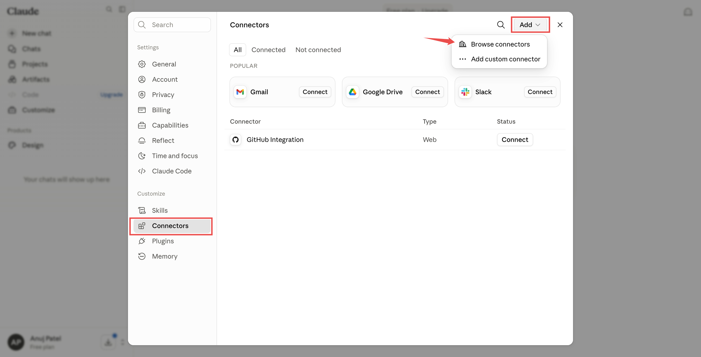
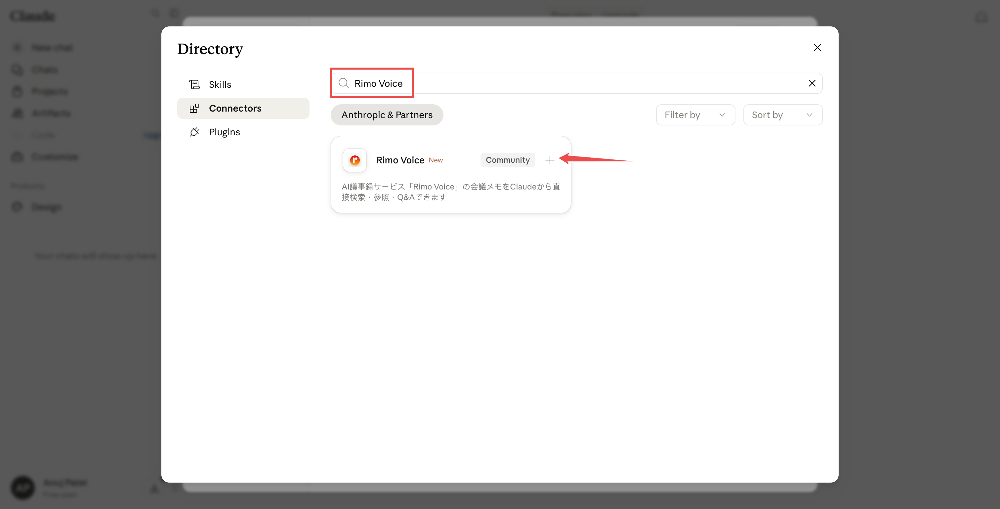
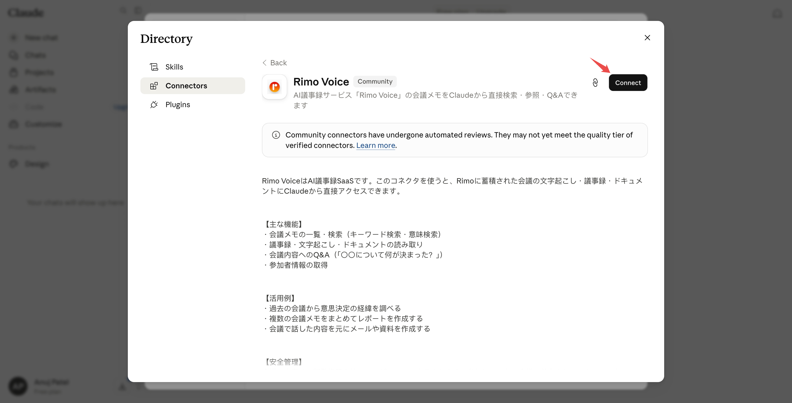
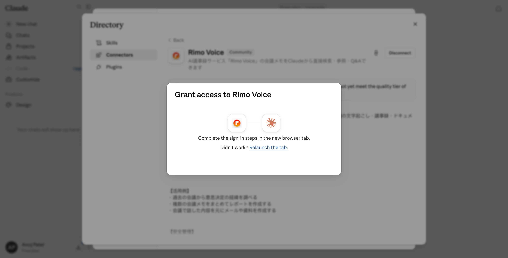
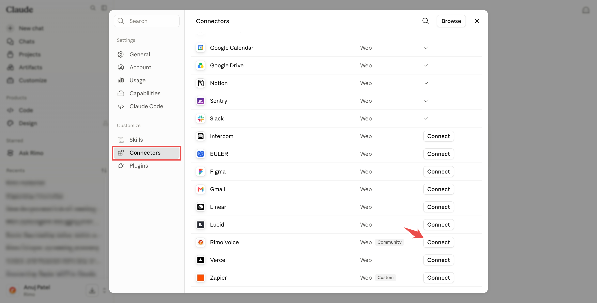
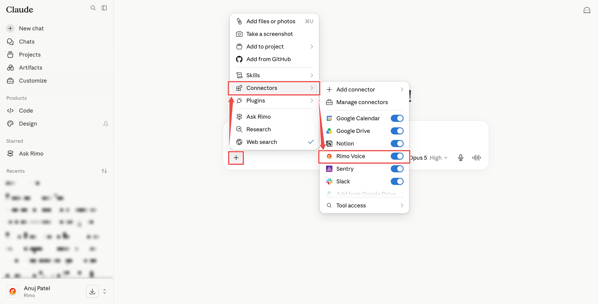
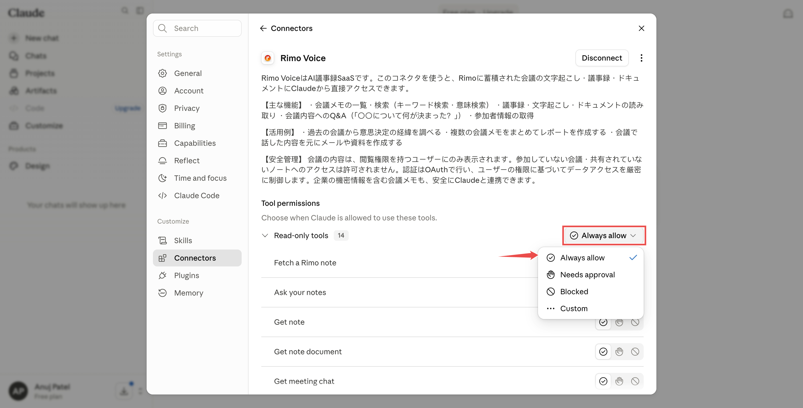
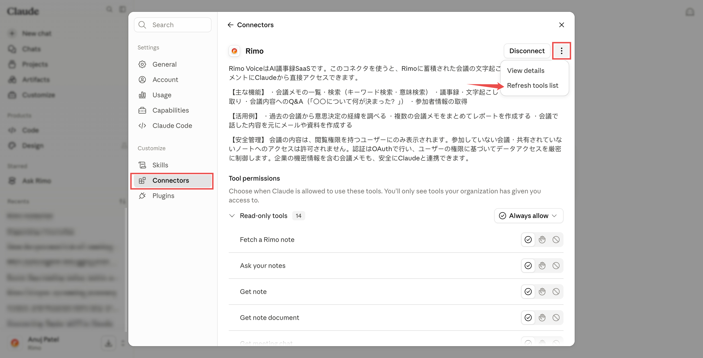

# Rimo in Claude

[English](../en/rimo-in-claude.md) | [日本語](../ja/rimo-in-claude.md)

Connect Rimo to **Claude** and ask about your meeting notes right inside the chat. Claude looks things up in Rimo and answers:

- *"What did we decide in Monday's call, according to my Rimo notes?"*
- *"Summarise last week's client meeting from Rimo."*

**Rimo Voice** is listed in Claude's connector directory: find it in Claude, click **Connect**, sign in with your usual Rimo account in your browser, and you're done.

Open the link below to land straight on Rimo Voice with its **Connect** button:

```
https://claude.ai/directory/connectors/rimo-voice
```

The steps below are the same on **claude.ai** in the browser and in the **Claude desktop app** — the connector belongs to your Claude account, so you set it up once and it works in both.

> Using ChatGPT or Microsoft Copilot instead? See [Rimo in ChatGPT](rimo-in-chatgpt.md) or [Rimo in Microsoft Copilot](rimo-in-microsoft.md). On your own machine with a coding tool (Claude Code, Cursor, Codex)? See [Rimo in Coding Tools](setup-guide.md).

---

## Before you start

- A **Rimo account** — the same one you normally sign in with.
- A Claude account. Connectors from the directory are available on Claude's **Free, Pro, Max, Team, and Enterprise** plans:
  - **Free / Pro / Max** — connect it yourself.
  - **Team / Enterprise** — an admin enables Rimo Voice for the organization; each member then clicks **Connect**.

> You never type a Rimo password or key into Claude. You sign in on Rimo's own page, in your browser.

---

## Connect Rimo Voice

### If you're on Claude's Free, Pro, or Max plan

> Shortcut: opening [claude.ai/directory/connectors/rimo-voice](https://claude.ai/directory/connectors/rimo-voice) takes you straight to the listing in step 4 — skip steps 1–3.

1. Open **[Customize → Connectors](https://claude.ai/customize/connectors)** in Claude.
2. Click the **Add** button (top right of the Connectors page), then choose **Browse connectors**.

   

3. Search for **Rimo Voice** and open the result.

   

4. Click **Connect**.

   

5. A new browser tab opens on Rimo's own sign-in page — see [Sign in to Rimo](#sign-in-to-rimo). Claude waits on a **Grant access to Rimo Voice** dialog until you finish there.

   

### If you're on Claude's Team or Enterprise plan

#### Step 1 — an admin enables Rimo Voice for the organization (once)

1. Open **[Admin settings → Connectors](https://claude.ai/admin-settings/connectors)**.
2. Find **Rimo Voice** in the directory and enable it for the organization.

   <!-- screenshot: ../images/assets/claude-org-add.png — Admin settings → Connectors, with Rimo Voice in the directory and the enable action marked -->

If that page isn't available to you, ask whoever manages your Claude workspace — enabling connectors for an organization needs admin permission (see [Claude's guide](https://support.claude.com/en/articles/11176164-use-connectors-to-extend-claude-s-capabilities)).

#### Step 2 — each member connects (once per member)

1. Open **[Customize → Connectors](https://claude.ai/customize/connectors)**.
2. Find the **Rimo Voice** connector in the list and click **Connect**.

   

3. A browser tab opens — see [Sign in to Rimo](#sign-in-to-rimo).

> **On a Team plan without permission to enable connectors?** The directory shows **Request** instead of a connect action. Click it and your organization's admins get the request; the button reads **Requested** while it's pending, and Claude tells you the outcome the next time you open the directory.

---

## Sign in to Rimo

When you connect Rimo Voice, Claude opens a browser tab on Rimo's own sign-in page:

1. **Sign in to Rimo** with your usual account.
2. **Pick an organization.** The screen shows that Claude is asking for access and asks which **organization** it may look at. The **Approve** button stays greyed out until you choose one.
3. Click **Approve**. (**Deny** cancels.)

   <!-- screenshot: ../images/assets/claude-rimo-approve.png — the Rimo consent screen, with the organization selector and the Approve button marked -->

You won't need to do this again unless you disconnect.

---

## Turn it on in a chat

1. In any conversation, click the **+** button at the lower left of the chat box.
2. Choose **Connectors** and switch **Rimo Voice** on.

   

3. Ask away — e.g. *"Search my Rimo notes for the pricing discussion and tell me what we decided."*

---

## Approve every tool at once

After you connect, Claude asks for your approval the first time it uses each tool. To approve them all in one go instead:

1. Open **[Customize → Connectors](https://claude.ai/customize/connectors)** and click **Rimo Voice**.
2. Under **Tool permissions**, set the **Read-only tools** group to **Always allow**.

   

Every Rimo Voice tool is read-only — none of them change anything in Rimo. You can also set a single tool to **Needs approval** or **Blocked** from the same list.

---

## Refresh the tool list

Rimo adds new tools from time to time. If Claude isn't showing the latest ones, refresh the list:

1. Open **[Customize → Connectors](https://claude.ai/customize/connectors)** and click **Rimo Voice**.
2. Open the **⋯** menu (top right, next to **Disconnect**) and choose **Refresh tools list**.

   

---

## Example things to ask

- "Show me my Rimo notes from this week."
- "Which Rimo meetings did I attend last sprint?"
- "Get the transcript of my last Rimo meeting."
- "Who was in that meeting?"
- "Find my Rimo notes about pricing strategy."
- "Find my notes about onboarding — even the ones that don't use that exact word."
- "Looking at my Rimo notes, what did we decide about the Q3 release?"

Rimo only ever shows Claude what **you** can see in Rimo.

---

## Switching organizations & turning it off

- **One organization at a time.** A connection looks at the single organization you picked when you signed in. To use a different one, disconnect and connect again, choosing the other organization.
- **Turn it off any time.** Open **[Customize → Connectors](https://claude.ai/customize/connectors)**, click **Rimo Voice**, and click **Disconnect**.

---

## If something doesn't work

**You can't find Rimo Voice in the directory.** Search for `Rimo Voice`, not just `Rimo`, and make sure you're on the **Connectors** tab of the directory rather than Skills or Plugins. You can also open the listing directly at [claude.ai/directory/connectors/rimo-voice](https://claude.ai/directory/connectors/rimo-voice). On Team / Enterprise, an admin has to enable it for the organization first — if you see **Request**, click it to ask them.

**Sign-in works but "Approve" stays greyed out.** Pick an organization on the sign-in screen first — then **Approve** becomes clickable.

**Claude can't find a note you know exists.** It only sees what your own account can see, in the one organization you connected. If the note is in a different organization, reconnect and pick that one. A note a colleague never shared with you won't show up.

---

## Official Claude help

- [Connectors directory](https://claude.com/docs/connectors/directory)
- [Use connectors to extend Claude's capabilities](https://support.claude.com/en/articles/11176164-use-connectors-to-extend-claude-s-capabilities)

---

## See also

- [Rimo in ChatGPT](rimo-in-chatgpt.md) — the same thing for ChatGPT
- [Rimo in Microsoft Copilot](rimo-in-microsoft.md) — connect through a Copilot Studio agent using DCR
- [Authentication](authentication.md) — how Rimo sign-in and accounts work
