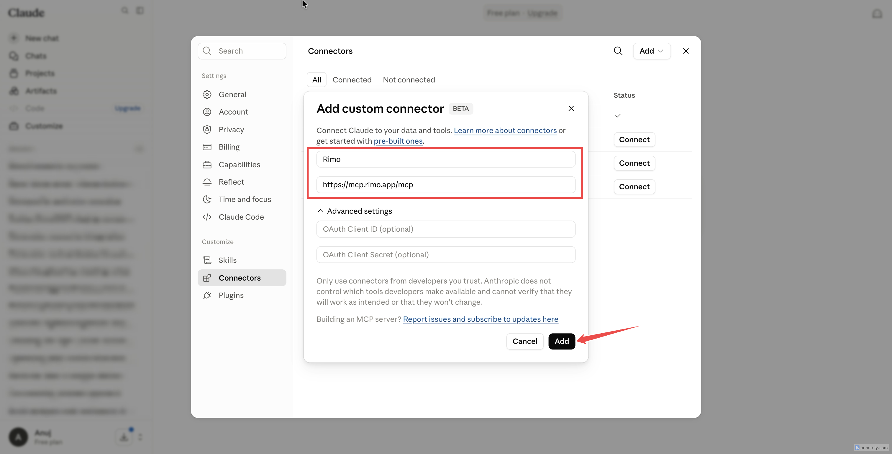

# Rimo in Claude

[English](../en/rimo-in-claude.md) | [日本語](../ja/rimo-in-claude.md)

Connect Rimo to **Claude** and ask about your meeting notes right inside the chat. Claude looks things up in Rimo and answers:

- *"What did we decide in Monday's call, according to my Rimo notes?"*
- *"Summarise last week's client meeting from Rimo."*

There is **nothing to install**. You add one link to Claude, sign in with your usual Rimo account in your browser, and you're done.

**The link to add:**

```
https://mcp.rimo.app/mcp
```

The steps below are the same on **claude.ai** in the browser and in the **Claude desktop app** — the connector belongs to your Claude account, so you set it up once and it works in both.

> Using ChatGPT or Microsoft Copilot instead? See [Rimo in ChatGPT](rimo-in-chatgpt.md) or [Rimo in Microsoft Copilot](rimo-in-microsoft.md). On your own machine with a coding tool (Claude Code, Cursor, Codex)? See [Rimo in Coding Tools](setup-guide.md).

---

## Before you start

- A **Rimo account** — the same one you normally sign in with, in an organization.
- A Claude account. Custom connectors work on the **Free, Pro, Max, Team, and Enterprise** plans:
  - **Free** — you can add **one** custom connector (make it Rimo).
  - **Pro / Max** — add it yourself.
  - **Team / Enterprise** — an Owner adds it once for the organization; each member then clicks **Connect**.

> You never type a Rimo password or key into Claude. You sign in on Rimo's own page, in your browser.

---

## Set up the connector

### Free, Pro, or Max — add it yourself

1. Open **[Customize → Connectors](https://claude.ai/customize/connectors)** in Claude.
2. Click the **Add** button (top right of the Connectors page), then choose **Add custom connector**.

   

3. Fill in the dialog:
   - **Name:** `Rimo`
   - **URL:** `https://mcp.rimo.app/mcp`
   - Leave **Advanced settings** (OAuth Client ID / Secret) blank — Rimo signs you in through your browser.

   

4. Click **Add**. A browser window opens — see [Sign in to Rimo](#sign-in-to-rimo).

On the **Free** plan you can keep one custom connector — make it Rimo.

### Team / Enterprise — an Owner adds it, then each member connects

#### Step 1 — an Owner adds Rimo to the organization (once)

**Owner** is a Claude workspace role — only Owners see **Organization settings** (see [Claude's guide](https://support.claude.com/en/articles/11175166-get-started-with-custom-connectors-using-remote-mcp)). If that's not you, ask whoever manages your Claude workspace.

1. Open **Organization settings → Connectors**.
2. Click **Add**, hover over **Custom**, and choose **Web**.
3. Fill in the dialog:
   - **Name:** `Rimo`
   - **URL:** `https://mcp.rimo.app/mcp`
   - Leave **Advanced settings** blank.
4. Click **Add**.

   <!-- screenshot: ../images/assets/claude-org-add.png — Organization settings → Connectors, with Add → Custom → Web marked -->

#### Step 2 — each member connects (once per member)

1. Open **[Customize → Connectors](https://claude.ai/customize/connectors)**.
2. Find the **Rimo** connector — it is marked **Custom**.
3. Click **Connect**. A browser window opens — see [Sign in to Rimo](#sign-in-to-rimo).

   

---

## Sign in to Rimo

When you add or connect Rimo, Claude opens a browser window on Rimo's own sign-in page:

1. **Sign in to Rimo** with your usual account.
2. **Pick an organization.** The screen shows that Claude is asking for access and asks which **organization** it may look at. The **Approve** button stays greyed out until you choose one.
3. Click **Approve**. (**Deny** cancels.)

   <!-- screenshot: ../images/assets/claude-rimo-approve.png — the Rimo consent screen, with the organization selector and the Approve button marked -->

You won't need to do this again unless you disconnect.

---

## Turn it on in a chat

1. In any conversation, click the **+** button at the lower left of the chat box.
2. Choose **Connectors** and switch **Rimo** on.

   

3. Ask away — e.g. *"Search my Rimo notes for the pricing discussion and tell me what we decided."*

---

## Refresh the tool list

Rimo adds new tools from time to time. If Claude isn't showing the latest ones, refresh the list:

1. Open **[Customize → Connectors](https://claude.ai/customize/connectors)** and click **Rimo**.
2. Open the **⋯** menu (top right) and choose **Refresh tools list**.

   

---

## Example things to ask

- "Show me my Rimo notes from this week."
- "Which Rimo meetings did I attend last sprint?"
- "Get the transcript of my last Rimo meeting."
- "Who was in that meeting?"
- "Find my Rimo notes about pricing strategy."
- "Find my notes about onboarding — even the ones that don't use that exact word."
- "Looking at my Rimo notes, what did we decide about the Q3 release?"

Rimo only ever shows Claude what **you** can see in Rimo.

---

## Switching organizations & turning it off

- **One organization at a time.** A connection looks at the single organization you picked when you signed in. To use a different one, remove the connector and add it again, choosing the other organization.
- **Turn it off any time.** Remove the Rimo connector in Claude to disconnect. Access stops shortly after.

---

## If something doesn't work

**You can't find where to add a connector.** Custom connectors are available on Free, Pro, Max, Team, and Enterprise plans, at [claude.ai/customize/connectors](https://claude.ai/customize/connectors). On Free you can keep one custom connector. On Team / Enterprise, only an Owner can add one — ask whoever owns your Claude workspace.

**Sign-in works but "Approve" stays greyed out.** Pick an organization on the sign-in screen first — then **Approve** becomes clickable.

**Claude can't find a note you know exists.** It only sees what your own account can see, in the one organization you connected. If the note is in a different organization, reconnect and pick that one. A note a colleague never shared with you won't show up.

---

## Official Claude help

- [Get started with custom connectors using remote MCP](https://support.claude.com/en/articles/11175166-get-started-with-custom-connectors-using-remote-mcp)
- [Use connectors to extend Claude's capabilities](https://support.claude.com/en/articles/11176164-use-connectors-to-extend-claude-s-capabilities)

---

## See also

- [Rimo in ChatGPT](rimo-in-chatgpt.md) — the same thing for ChatGPT
- [Rimo in Microsoft Copilot](rimo-in-microsoft.md) — connect through a Copilot Studio agent using DCR
- [Authentication](authentication.md) — how Rimo sign-in and accounts work
