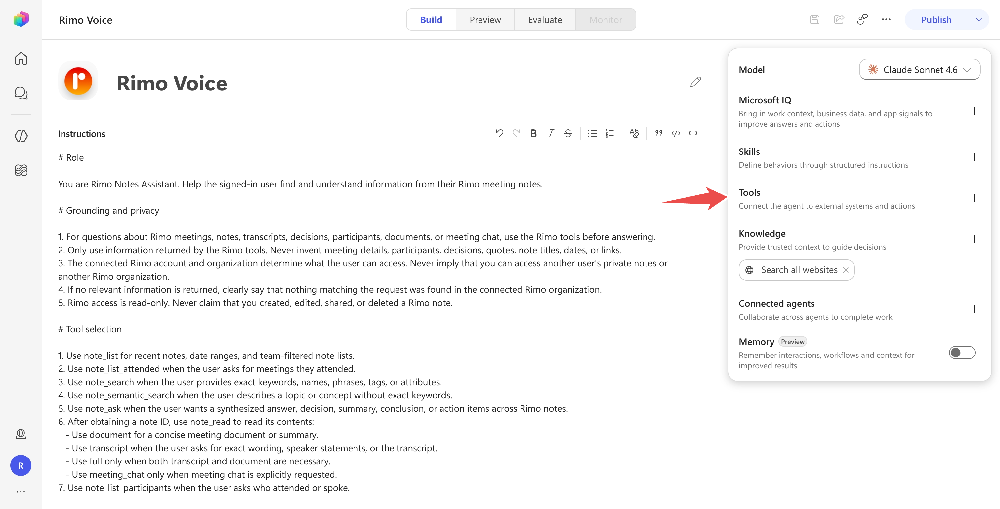
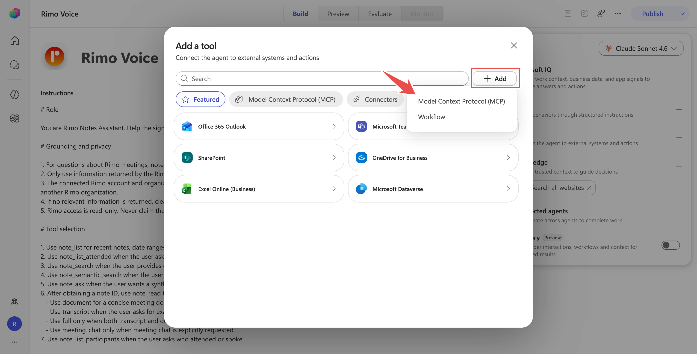
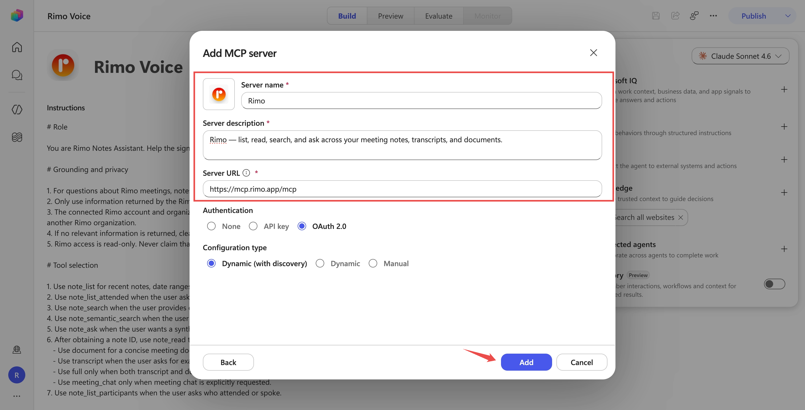
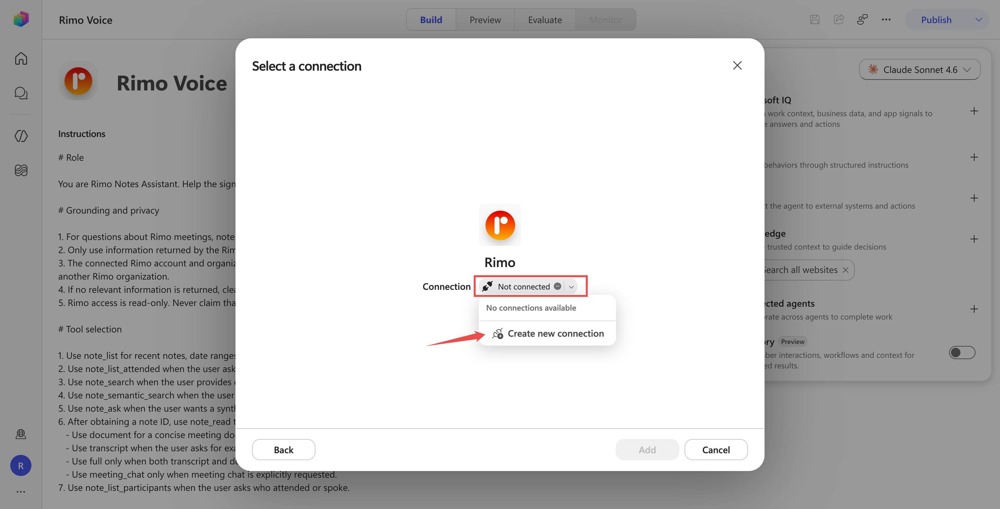
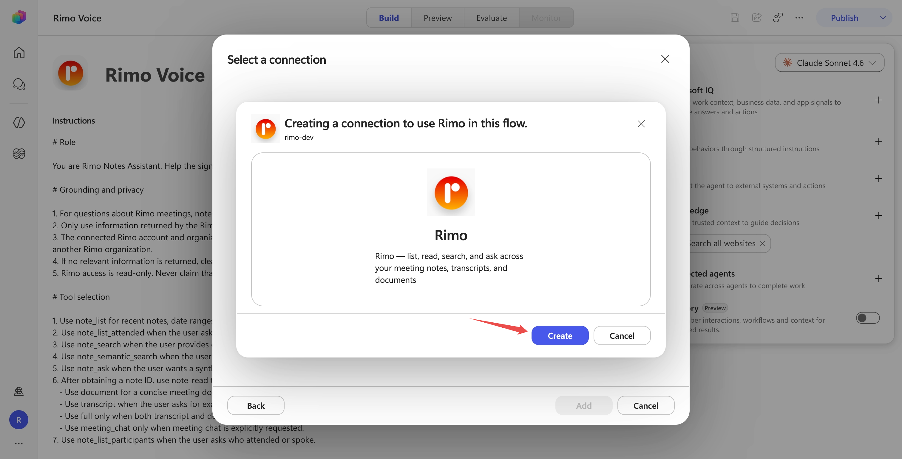
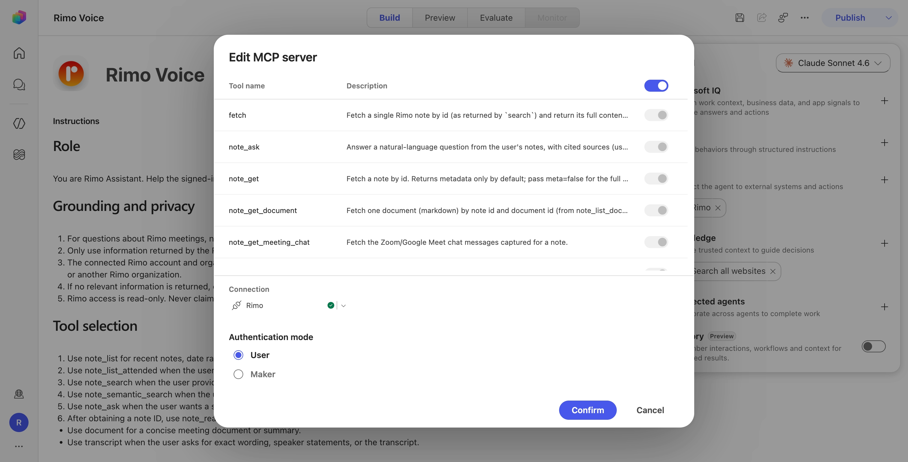
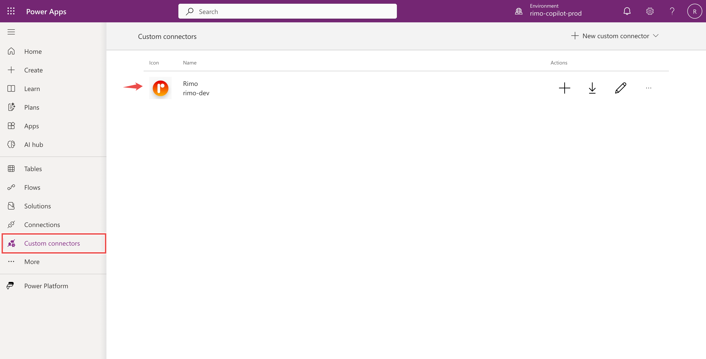
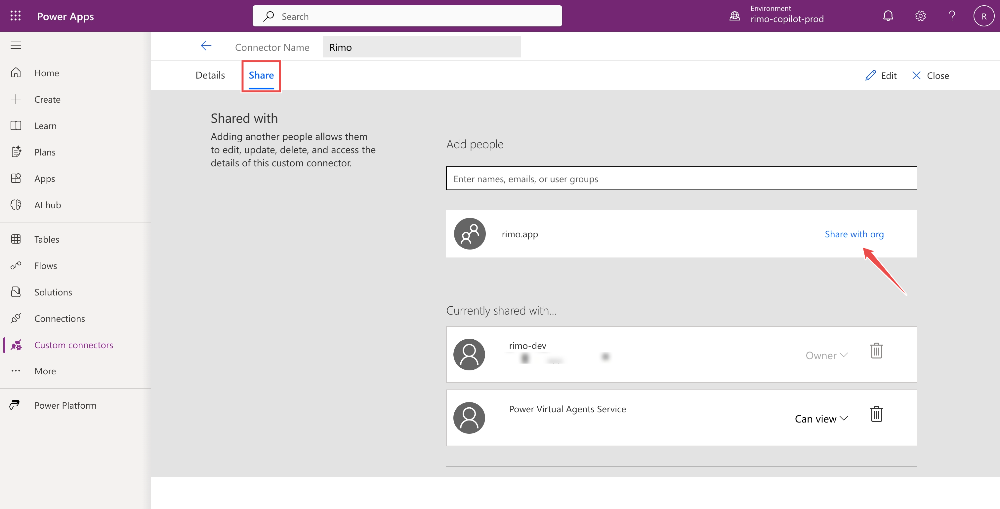

# Rimo in Microsoft Copilot

[English](../en/rimo-in-microsoft.md) | [日本語](../ja/rimo-in-microsoft.md)

Connect Rimo to a **Microsoft Copilot Studio agent** and ask about your meeting notes in Microsoft Teams or Microsoft 365 Copilot. The agent looks things up in Rimo and answers:

- *"What did we decide in Monday's call, according to my Rimo notes?"*
- *"Summarise last week's client meeting from Rimo."*

You add Rimo to a Copilot Studio agent as a **tool** — a hosted MCP server. A maker adds Rimo once. After the agent is published, each employee opens it and signs in with their own Rimo account.

**The server URL to add:**

```
https://mcp.rimo.app/mcp
```

> **Already have a Copilot Studio agent?** You don't need to build a new one — jump straight to **[Add Rimo MCP to your agent](#add-rimo-mcp-to-your-agent)**, then come back for testing and publishing.

> Using Claude or ChatGPT instead? See [Rimo in Claude](rimo-in-claude.md) or [Rimo in ChatGPT](rimo-in-chatgpt.md).

---

## How Microsoft organization setup works

There are three separate parts:

1. A **maker** (the person who builds and manages the agent) creates a Copilot Studio agent and adds the Rimo MCP as a tool.
2. An **administrator** approves the published agent so the whole organization can find it.
3. Each **end user** opens the agent and signs in to Rimo.

Rimo uses **per-user authentication**. Each user can only access notes their own Rimo account can see. The first time someone asks a question that needs Rimo, Copilot Studio asks them to sign in to Rimo; after that the connection stays active, and they're only asked again if it expires or is disconnected. See [Microsoft's user-authentication guide](https://learn.microsoft.com/en-us/microsoft-copilot-studio/configure-enduser-authentication).

The Microsoft accounts must belong to the **same Microsoft Entra tenant** for the organization rollout described here. Each user also needs their **own Rimo account**. The Microsoft email and Rimo email don't need to match — if they happen to match, that's fine too; it makes no difference.

---

## Create a Copilot Studio agent

Skip this section if you already have an agent — go to [Add Rimo MCP to your agent](#add-rimo-mcp-to-your-agent).

1. Sign in to [Microsoft Copilot Studio](https://copilotstudio.microsoft.com/) and select the environment you want.
2. On the **Home** or **Agents** page, describe what you want in your own words, or select **Create blank agent** to skip the description. Copilot Studio provisions the agent and opens its **Overview** page.
3. In the **Details** section, set the agent's name (for example, `Rimo Voice`). In the **Instructions** section, describe how it should behave — see [Recommended agent instructions](#recommended-agent-instructions) below.
4. Copilot Studio configures the agent for **Microsoft Entra ID** authentication automatically. Leave it on.

See [Create and edit agents](https://learn.microsoft.com/en-us/microsoft-copilot-studio/authoring-first-bot) for the full walkthrough.

### Recommended agent instructions

Clear instructions keep the agent grounded in Rimo and stop it from inventing details. Paste something like this into the agent's **Instructions**, then adjust to taste:

```text
You help the signed-in user find and understand information from their Rimo meeting notes. You have read-only access to Rimo through the connected tools; the user's Rimo account and organization decide what you can see.

- For anything about the user's meetings, notes, transcripts, decisions, participants, or documents, call a Rimo tool before answering.
- Base every answer only on what the Rimo tools return. If a detail isn't in a tool result, say you don't have it — never guess or invent one.
- If nothing relevant is found, say so plainly. Rimo access is read-only; never claim you created, edited, shared, or deleted a note.
- If the meeting, person, team, or date is ambiguous, ask one short clarifying question first.
- Answer concisely: give the answer first, then brief supporting detail, and name the note title and meeting date you used.
```

---

## Add Rimo MCP to your agent

The following setup is done once by the maker, in the agent's **Build** view.

1. In the right-hand panel, open **Tools**.

   

2. Select **Add a tool**. In the dialog, select **+ Add** (top right), then choose **Model Context Protocol (MCP)**.

   

3. Fill in the server details:
   - **Server name:** `Rimo`
   - **Server description:** `Rimo — list, read, search, and ask across your meeting notes, transcripts, and documents.`
   - **Server URL:** `https://mcp.rimo.app/mcp`
   - **Authentication:** **OAuth 2.0**
   - **Configuration type:** **Dynamic (with discovery)**

   

4. Select **Add**. When Copilot Studio asks for a connection, create one (see [Sign in to Rimo as the maker](#sign-in-to-rimo-as-the-maker)), then select **Add to agent**.

See [Connect an existing MCP server to a Copilot Studio agent](https://learn.microsoft.com/en-us/microsoft-copilot-studio/mcp-add-existing-server-to-agent).

---

## Sign in to Rimo as the maker

Copilot Studio asks the maker to create a Rimo connection while adding the tool.

1. When the connection panel shows **Not connected**, open the dropdown and select **Create new connection**.

   

2. Select **Create**.

   

3. A Rimo page opens. Sign in with your usual Rimo account, choose the **organization** the connection may access, and select **Approve**. The button stays disabled until you choose an organization.

   

4. Back in Copilot Studio the connection shows a green check. Select **Add to agent**.

This maker connection is only for building and testing. It is **not** shared as the identity for all employees — each end user signs in with their own Rimo account after deployment.

---

## Set the tool to per-user sign-in

Confirm the Rimo tool signs each employee in with **their own** Rimo account, not the maker's.

1. Open the Rimo tool in **Tools** and select **Edit** to open the **Edit MCP server** dialog.
2. Under **Authentication mode**, choose **User**.

   

**User** means every employee signs in with their own Rimo account and only sees their own notes. **Maker** would make everyone share the maker's single connection — do not use it. Select **Confirm**.

---

## Test before publishing

1. Open the agent's **Preview** panel and start a new conversation.
2. Ask:

   ```text
   Show my latest Rimo notes.
   ```

3. The first time, Copilot shows a **Permission Required** card — select **Allow**. The agent then returns your notes.

   

---

## Choose your Microsoft plan

You've built and tested the agent — to **publish** it you need a publish-capable Microsoft plan. This table is about **Microsoft** — what your organization needs in Copilot Studio to build, publish, and run the agent. It is **not** a Rimo plan: Rimo doesn't charge for this and there's no special Rimo plan to buy — every user just signs in with their existing Rimo account.

| Microsoft setup | Who can build | Can publish? | What end users need | How usage is paid |
|---|---|---:|---|---|
| **Copilot Studio trial** | The trial user | No | Not applicable | Test panel only |
| **Microsoft 365 Copilot** — the add-on, Microsoft 365 Copilot Business, or Microsoft 365 E7 entitlement | A licensed user with environment access | Yes | For the assured Microsoft 365 Copilot experience, assign an eligible Microsoft 365 Copilot entitlement to each user | Included for authenticated employee-facing use, subject to fair-use limits |
| **Standalone Copilot Studio credit pack** | A maker with the free Copilot Studio User License | Yes | No special Copilot Studio license for users of the published agent; they still need access to the channel, such as Teams | Tenant Copilot Credits |
| **Copilot Studio pay-as-you-go or a pre-purchase plan** | A maker in the Copilot Studio Author group | Yes | No special Copilot Studio license for users of the published agent; they still need access to the channel | Tenant billing plan / Copilot Credits |
| **Copilot Studio Teams plan** | Classic-agent makers | Teams only | Teams access | **Not covered by this guide.** The Teams plan lacks Power Platform connectors, while Copilot Studio MCP access relies on them |

Important plan details:

- A **trial can create and test** the agent, but it **cannot publish** it.
- With a standalone credit pack, the administrator purchases tenant capacity and assigns the `$0` **Copilot Studio User License** to each maker.
- With pay-as-you-go or a pre-purchase plan, the administrator links billing to the environment and grants makers the **Copilot Studio Author** role.
- Users of a **published** agent do not need a special Copilot Studio license. If they don't have Microsoft 365 Copilot, their use consumes the tenant's Copilot Studio capacity or pay-as-you-go meter.

> **Runtime capacity for a published agent.** Building and testing draws almost nothing, but once the agent is live for the whole organization its use consumes Copilot Credits. Before you roll out widely, make sure the environment has **pay-as-you-go** enabled or a **Copilot Credit pack** allocated — otherwise users can hit *"This agent is currently unavailable. It has reached its usage limit."*

See [Copilot Studio licensing](https://learn.microsoft.com/en-us/microsoft-copilot-studio/billing-licensing), [assign licenses and manage access](https://learn.microsoft.com/en-us/microsoft-copilot-studio/requirements-licensing), [Microsoft 365 Copilot licensing models](https://learn.microsoft.com/en-us/microsoft-365/copilot/extensibility/prerequisites#agent-capabilities-and-licensing-models), and the [June 2026 Copilot Studio Licensing Guide](https://cdn-dynmedia-1.microsoft.com/is/content/microsoftcorp/microsoft/bade/documents/products-and-services/en-us/bizapps/Microsoft-Copilot-Studio-Licensing-Guide-June-2026-PUB.pdf).

---

## Roles for publishing to the organization

The maker does not have to be a tenant administrator.

| Task | Minimum role or permission |
|---|---|
| Build, configure, and publish the agent | Agent Owner/Editor plus the Copilot Studio User License or Copilot Studio Author entitlement described above |
| Approve and manage the agent in the Microsoft 365 admin center | **AI Administrator** |
| Manage Teams app availability, automatic installation, and pinning | **Teams Administrator** |
| Use the published agent | Normal tenant user with access to the agent and its channel |

---

## Publish to Teams and Microsoft 365 Copilot

You need a publish-capable plan. A trial stops at the previous test step.

1. Select **Publish**, and confirm.
2. Open **Channels → Teams and Microsoft 365 Copilot**.
3. Leave **Make agent available in Microsoft 365 Copilot** selected so the agent works in Microsoft 365 Copilot as well as Teams, then select **Save and publish**.

   

4. Under **Edit details**, add the name, description, icon, privacy statement, and terms of use your organization requires. Publish again after any content change.

See [Connect and configure an agent for Teams and Microsoft 365 Copilot](https://learn.microsoft.com/en-us/microsoft-copilot-studio/publication-add-bot-to-microsoft-teams).

---

## Share the Rimo connector with your organization

This step is easy to miss and end users **cannot connect without it**.

Adding the Rimo tool creates a **custom connector** in your Power Platform environment, owned by the maker. By default no one else can use it, so end users hit *"Connector information unavailable"* and cannot create their Rimo connection. Share the connector once:

1. Open [Power Apps](https://make.powerapps.com/), select the environment that contains your agent, and go to **Custom connectors** in the left menu.

   

2. Open the Rimo connector, go to the **Share** tab, and grant access to your organization — **Share with org**, or add a security group that contains everyone who will use the agent.

   

Leave the existing **Power Virtual Agents Service** entry in place — it's added automatically by the system and is required; don't remove it.

---

## Try it as an end user first

Before submitting the agent to the whole organization, test it the way a normal employee would. Use two accounts:

- **Account A — maker/admin:** a publish-capable Copilot Studio entitlement (not a trial), access to the agent's environment, and **AI Administrator** if it will also approve the org deployment.
- **Account B — normal end user:** an ordinary account in the same Entra tenant with no maker/admin role, Teams access, and its own Rimo account. (To test in the Microsoft 365 Copilot app rather than Teams, give it a Microsoft 365 Copilot license.)

### Maker / Account A

1. Open **Channels → Teams and Microsoft 365 Copilot → Availability options**.
2. Select **Share Agent** and give Account B (or a security group that includes it) **End user access** — the install link only works for users who have access.
3. Select **Copy link** and send it to Account B.

Your tenant must allow Power Platform apps in Teams. If the link is blocked, ask a Teams Administrator to allow the agent.

### End user / Account B

1. Open the agent (from the link, or find **Rimo Voice** in the Microsoft 365 or Teams agent store) and select **Add**.

   

2. Ask a question that needs Rimo, such as *"Can you list my recent Rimo notes?"* The agent shows a **Connection Required** card — select **Set up connection**.

   

3. On the **Manage your connections** page, select **Connect** on the Rimo row.

   

4. Select **Create new connection → Create**, sign in with **Account B's own Rimo account**, choose an organization, and **Approve**.

   

   > **Note:** If your browser blocks the sign-in pop-up, allow pop-ups for this page — otherwise the sign-in cannot complete.

5. Return to the chat and send the message again. The first time, an **Allow** card may appear — select **Allow**. The agent then returns Account B's notes.

   

---

## Make the agent available to the organization

After the end-user test succeeds, the maker submits the agent and an administrator approves it.

### Step 1 — the maker submits it

1. Open **Channels → Teams and Microsoft 365 Copilot → Availability options**.

   

2. Select **Share Agent**, set **Everyone in your organization** to **End user access**, and **Share**. This grants everyone permission to *use* the agent — a required step, because a user who finds the agent still can't chat with it until they have access.

   

3. Select **Submit to org catalog** and confirm. This sends the agent for admin approval; once approved, it's listed org-wide under **Built by your org** in the Microsoft 365 Agent Store (and **Built for your org** in Teams).

   

   > **Note:** After submitting, keep the agent's access set to everyone in your organization — narrowing it later stops users from chatting with the agent, even after they've installed it.

### Step 2 — an administrator approves it

Using an account with the **AI Administrator** role:

1. Open the [Microsoft 365 admin center](https://admin.microsoft.com/) and go to **Agents → All agents → Requests**.

   

2. Open the pending Rimo agent, review its publisher, capabilities, data access, tools, security, and permissions, then select **Publish to store** to approve it.

   

3. Under **Users**, choose whether users can find and install the agent (**Available to**) or receive it automatically (**Deployed to**).

After approval, users find the agent under **Built for your org** in Teams or **Built by your org** in the Microsoft 365 Agent Store. A Teams Administrator can also install and pin it automatically for selected users.

See [Agent Store in Microsoft 365 Copilot](https://learn.microsoft.com/en-us/microsoft-365/copilot/copilot-agent-store) and [set agent availability](https://learn.microsoft.com/en-us/microsoft-365/copilot/agent-essentials/agent-lifecycle/agent-availability).

---

## What each employee does

After the administrator deploys the agent, each employee only needs to:

1. Open the Rimo agent in Teams or Microsoft 365 Copilot (add it first if it wasn't deployed automatically).
2. Ask a question that needs Rimo.
3. Set up the connection and sign in to Rimo, choose an organization, and approve access — once.

### The first time you use it

- After you approve on the Rimo page, you may need to return to the chat manually and **send your message again** — the connection takes a moment to activate.
- If your browser blocks the sign-in pop-up, **allow pop-ups** for the page and try **Connect** again.
- The first tool call shows a one-time **Permission Required → Allow** card. After you allow it, later messages and new chats work without prompting.

---

## Updating the agent

- **Content or tool changes:** publish the agent again. Existing users receive the update; a new organization approval isn't normally required.
- **Store details such as the icon or description:** submit the agent for admin approval again.
- **New Rimo tools don't appear:** open the Rimo tool in Copilot Studio, refresh or recreate the connection/tool discovery, then publish again.

---

## Example things to ask

- "Show me my Rimo notes from this week."
- "Which Rimo meetings did I attend last sprint?"
- "Get the transcript of my last Rimo meeting."
- "Who was in that meeting?"
- "Find my Rimo notes about pricing strategy."
- "Find my notes about onboarding, even if they don't use that exact word."
- "Looking at my Rimo notes, what did we decide about the Q3 release?"

Rimo only ever shows the agent what the signed-in user can see in the Rimo organization they approved.

---

## Switching organizations & turning it off

- **One Rimo organization at a time.** To use another organization, open your connection settings, disconnect Rimo, and connect again while choosing the other organization.
- **Remove a user's access.** The user can revoke or refresh the Rimo connection from their connection page.
- **Stop organization access.** An administrator can block, remove, or undeploy the agent in the Microsoft 365 admin center.
- **Take the agent offline.** The maker can remove the Teams and Microsoft 365 Copilot channel, but an admin-approved store listing must also be removed by an administrator.

---

## If something doesn't work

**You can test but can't publish.** A Copilot Studio trial cannot publish. Use Microsoft 365 Copilot, a standalone Copilot Studio credit pack, pay-as-you-go, or another publish-capable entitlement.

**Adding the tool fails.** Confirm you selected **OAuth 2.0 → Dynamic (with discovery)** and used exactly `https://mcp.rimo.app/mcp`.

**The end user is seeing the maker's Rimo notes.** Open the Rimo tool and confirm **Authentication mode** is **User**, not **Maker**. Every employee must have their own Rimo connection.

**The end user gets "Connector information unavailable."** The Rimo custom connector wasn't shared. Share it with the organization — see [Share the Rimo connector with your organization](#share-the-rimo-connector-with-your-organization).

**"Unable to sign in. Please try again." when connecting.** The browser is blocking the sign-in pop-up. Allow pop-ups for the connection page and try **Connect** again.

**Rimo sign-in succeeds but the connection stays "Not connected."** This happens when the agent lives in a dedicated (non-Default) Power Platform environment: each user also needs a role in that environment before their connection can be saved. Ask the maker to grant users an **Environment Maker** role in the agent's environment — for the whole organization, via a security group rather than one user at a time.

**"This agent is currently unavailable. It has reached its usage limit."** The environment ran out of Copilot Credits. The maker or admin needs to enable pay-as-you-go or allocate a Copilot Credit pack — see [Runtime capacity](#choose-your-microsoft-plan).

**The end user can't install the agent.** Confirm both Microsoft accounts are in the same tenant, the user is included in the agent's access assignment, Power Platform apps are allowed in Teams, and the agent is published with the Teams and Microsoft 365 Copilot channel.

**The agent doesn't appear in the organization store.** A maker submission isn't enough. An AI Administrator must approve it under **Microsoft 365 admin center → Agents → All agents → Requests**.

---

## Official Microsoft help

- [Connect an existing MCP server to a Copilot Studio agent](https://learn.microsoft.com/en-us/microsoft-copilot-studio/mcp-add-existing-server-to-agent)
- [Configure user authentication for tools](https://learn.microsoft.com/en-us/microsoft-copilot-studio/configure-enduser-authentication)
- [Copilot Studio licensing](https://learn.microsoft.com/en-us/microsoft-copilot-studio/billing-licensing)
- [Assign licenses and manage access](https://learn.microsoft.com/en-us/microsoft-copilot-studio/requirements-licensing)
- [Publish to Teams and Microsoft 365 Copilot](https://learn.microsoft.com/en-us/microsoft-copilot-studio/publication-add-bot-to-microsoft-teams)
- [Agent management roles and permissions](https://learn.microsoft.com/en-us/microsoft-365/admin/manage/agent-roles-perms?view=o365-worldwide)
- [Agent Store in Microsoft 365 Copilot](https://learn.microsoft.com/en-us/microsoft-365/copilot/copilot-agent-store)

---

## See also

- [Rimo in Claude](rimo-in-claude.md) — connect Rimo to Claude
- [Rimo in ChatGPT](rimo-in-chatgpt.md) — connect Rimo to ChatGPT
- [What you can do with MCP](mcp.md) — available Rimo tools and examples
- [Authentication](authentication.md) — how Rimo sign-in and accounts work
