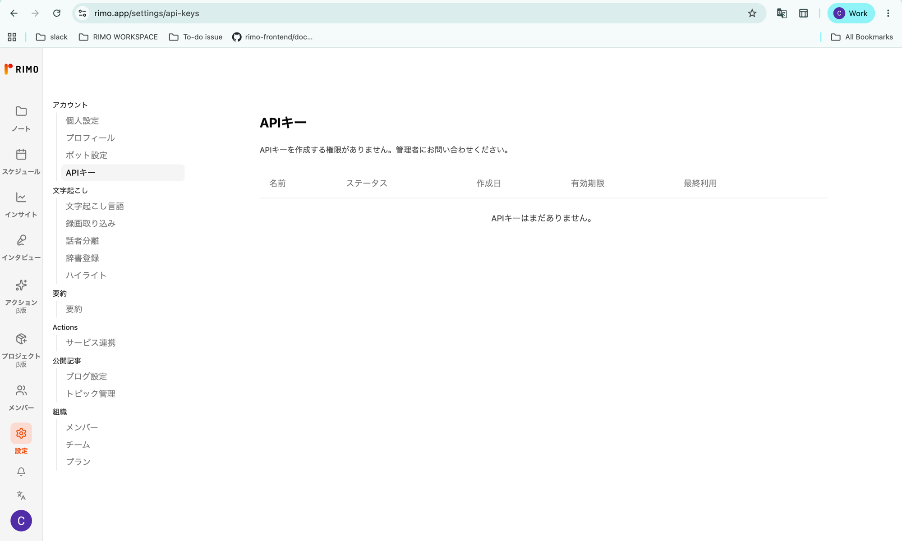
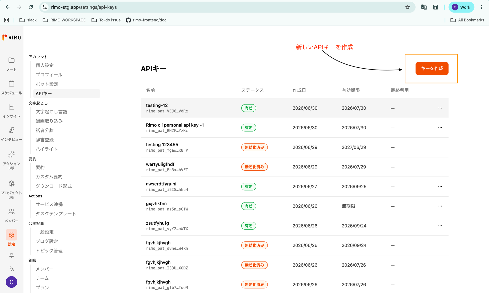
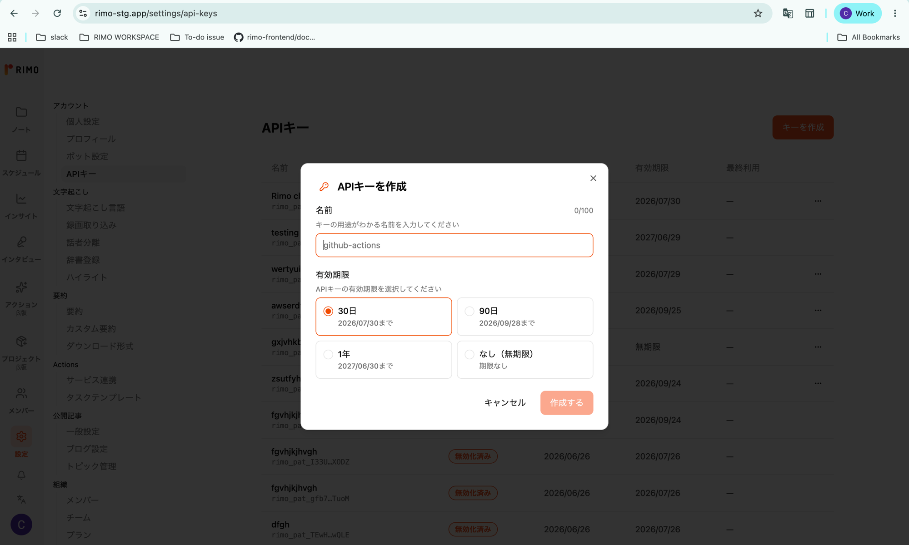
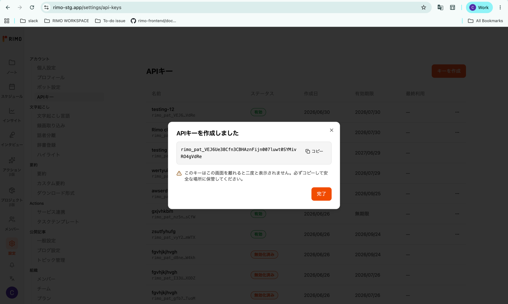
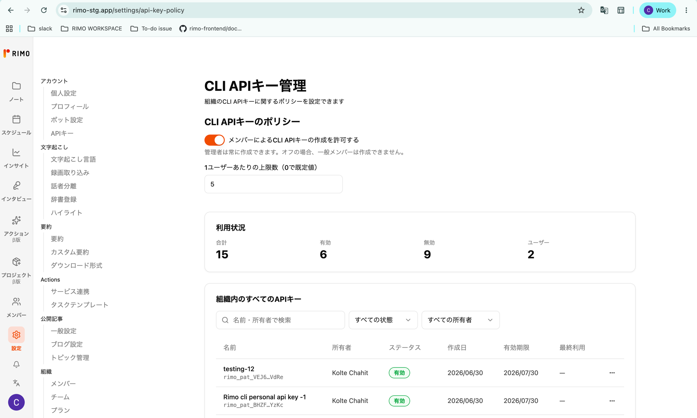
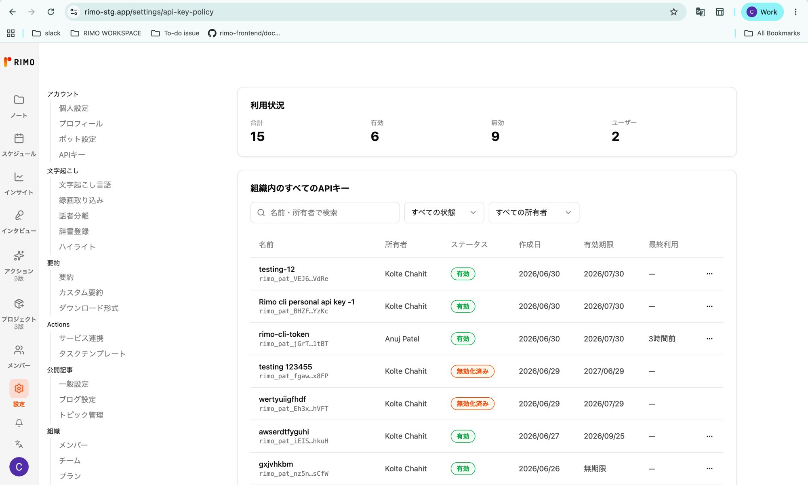
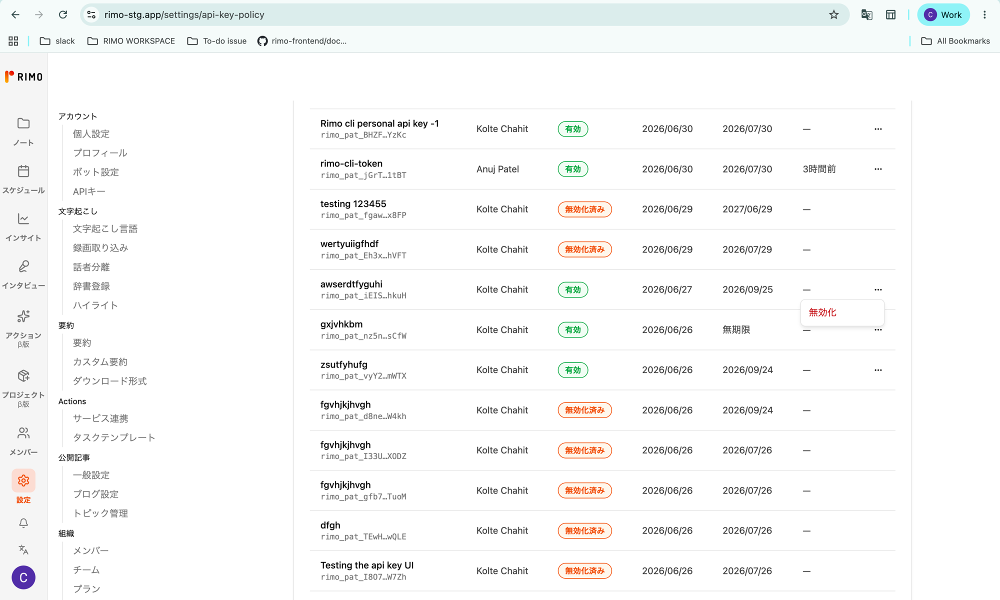

# APIキー

[English](../en/personal-api-keys.md) | [日本語](../ja/personal-api-keys.md)

**個人用 APIキー** を使うと、`rimo` を **ブラウザログインなしで** 認証できます。CI/CD パイプライン、スクリプト、定期実行ジョブに最適です。キーは Rimo の Web アプリで一度だけ作成し、`RIMO_API_KEY` 環境変数を通じて CLI に渡します。

自分のマシンでの日常的な対話利用には、代わりに [`rimo auth login`](authentication.md) を使ってください。APIキーは、ブラウザを開く人がいない自動化向けの仕組みです。

このガイドの内容:

- **[キーを作成する](#キーを作成する)** — Rimo の Web アプリで作成します。
- **[CLI でキーを使う](#cli-でキーを使う)** — `RIMO_API_KEY` を設定します。
- **[キーを管理する](#キーを管理する)** — 確認・追跡・無効化します。
- **[管理者設定](#管理者設定)** — 機能の有効化と、組織全体のキーの統制を行います。

## はじめる前に

個人用 APIキーは、組織ごとに **初期状態では無効** です。誰かが作成できるようになる前に、**組織の管理者が有効化する** 必要があります（[管理者設定](#管理者設定)を参照）。

有効化されるまでは、**「APIキー」** ページに *「APIキーを作成する権限がありません。管理者にお問い合わせください。」* と表示され、**「キーを作成」** ボタンは表示されません。管理者に機能の有効化を依頼してください（[管理者設定](#管理者設定)を参照）。



## キーを作成する

キーは CLI ではなく、Rimo の Web アプリで作成します。

### 1. APIキーのページを開く

Rimo の Web アプリで、**設定 → APIキー**（`rimo.app/settings/api-keys`）を開きます。



### 2. キーを作成する

1. **「キーを作成」** をクリックします。
2. キーの用途がわかる **名前** を入力します（例: `github-actions`）。これはキーを見分けるためのラベルで、キーの権限には影響しません。
3. **有効期限** を選びます。
   - **30日**
   - **90日**
   - **1年**
   - **なし（無期限）** — 手動で無効化するまで有効です。漏洩した場合のリスクが高いため、本当に必要な場合のみご利用ください。
4. **「APIキーを作成」** をクリックします。



### 3. キーをコピーする（表示されるのは一度だけ）

作成すると、Rimo はそのキーを **一度だけ** 表示します。キーは `rimo_pat_` で始まります。

1. **「コピー」** をクリックします。
2. 安全な場所に貼り付けます — パスワードマネージャーや、自動化ツールのシークレットストアなど（[CLI でキーを使う](#cli-でキーを使う)を参照）。チャット・メール・ソース管理にコミットされるファイルには、**絶対に貼り付けないでください**。
3. **「完了」** をクリックしてダイアログを閉じます。

> ⚠️ **この画面を離れると、キーは二度と表示されません。** 紛失した場合は復元できません。無効化して新しいキーを作成してください。



## CLI でキーを使う

`rimo` は `RIMO_API_KEY` 環境変数からキーを読み取ります。コピーした値（`rimo_pat_…` の文字列）を設定します。

```bash
export RIMO_API_KEY="rimo_pat_xxxxxxxxxxxxxxxxxxxxxxxxxxxxxxxxxxxxxxxxxxxx"

rimo note list        # すぐに動作します。`rimo auth login` は不要です
```

CI/CD（GitHub Actions、GitLab CI など）では、キーを直接書き込まず、暗号化された **シークレット** として `RIMO_API_KEY` を登録します。GitHub Actions の例:

```yaml
- run: rimo note search "Q3 release plan"
  env:
    RIMO_API_KEY: ${{ secrets.RIMO_API_KEY }}
```

知っておくと便利な点:

- 同じマシンでは、**`RIMO_API_KEY` がブラウザログインより優先** されます。設定されている間、`rimo` はこのキーを使い、`rimo auth login` のアカウントは無視します。ログイン済みアカウントに戻すには、変数を解除してください。
- 不正・不正な形式のキーは、ネットワーク通信の前に **即座にエラー** になります。
- トークン解決の全順序や対話ログインとの違いは [認証](authentication.md) を参照してください。

## キーを管理する

**APIキー** ページには、作成したすべてのキーが一覧表示されます。各キーで次を確認できます。

- **名前**
- **ステータス** — 下記の値
- **作成日**
- **有効期限** — 期限の日付、または *無期限*
- **最終使用** — キーが最後にリクエストを認証した日時（未使用の場合はダッシュ `—`）

ステータスの値:

| ステータス | 意味 |
|------------|------|
| **有効** | 利用可能な状態。 |
| **残り N 日** | 有効だが、まもなく期限切れ（14 日以内）。 |
| **期限切れ** | 有効期限を過ぎており、利用不可。 |
| **無効化済み** | 手動で無効化されており、利用不可。 |

### キーを無効化する

不要になったキー、または漏洩の疑いがあるキーは無効化します。

1. キーの行の **⋯**（3 点）メニューをクリックします。
2. **「無効化」** を選び、確定します。

> ⚠️ 無効化は **即時かつ取り消し不可** です。そのキーを使用している自動化はただちに動作しなくなり、再有効化はできません。再度必要な場合は新しいキーを作成してください。

## 管理者設定

組織の管理者は、メンバーがキーを作成 **できるかどうか**、各人が **いくつまで** 持てるかを決められます。また、組織内のあらゆるキーを **確認・無効化** できます。

**設定 → CLI APIキー管理**（`rimo.app/settings/api-key-policy`）を開きます。このページは管理者にのみ表示されます。



### メンバーによるキー作成を許可する

この機能は **初期状態では無効** です。

- **「メンバーによるCLI APIキーの作成を許可する」** をオンにすると、一般メンバーが自分のキーを作成できます。
- 管理者はこの設定に関わらず常に作成できます。オフの間、一般メンバーは作成できません。

### メンバー 1 人あたりのキー数を制限する

**「1ユーザーあたりの上限数（0で既定値）」** を設定します。

- **0** で既定値が使われます。
- 任意の整数で、1 人が持てるキー数を制限できます。メンバーが上限に達すると、不要なキーの無効化、または管理者への上限引き上げ依頼が案内されます。

### 組織内のキーを監視・無効化する

- **利用状況** に組織全体の合計が表示されます: **合計**・**有効**・**無効**・キーを持つ **ユーザー** 数。
- **組織内のすべてのAPIキー** は、各キーの **名前**・**所有者**・**ステータス**・**作成日**・**有効期限**・**最終利用** を表示する検索・絞り込み可能な一覧です。名前・所有者で検索、またはステータス・所有者で絞り込めます。



漏洩の疑いがある、または退職者のキーなどを停止するには、その行の **⋯** メニューを開いて **「無効化」** を選びます。メンバー自身による無効化と同様に、即時に反映され、取り消しはできません。



## トラブルシューティング

| 表示・症状 | 意味・対処 |
|------------|------------|
| **「APIキー」ページや作成ボタンが見当たらない** | 管理者がまだ機能を有効化していないか、アカウントに作成権限がありません。管理者にお問い合わせください。 |
| **APIキーの作成上限に達しました** | すでに上限数のキーを持っています。不要なキーを無効化するか、管理者に上限の引き上げを依頼してください。 |
| **CLI が認証エラーを返す** | `RIMO_API_KEY` が正しく設定されているか、キーが **期限切れ** や **無効化済み** でないかを確認してください。`rimo auth status` で CLI の認証解決状況を確認できます。 |
| **キーを紛失した** | キーは作成後に復元できません。古いキーを無効化し、新しいキーを作成してください。 |

## セキュリティに関する注意

- APIキーはパスワードと同様に扱ってください。キーを持つ人は誰でも、Rimo 上であなたとして操作できます。
- キーはシークレットマネージャー / CI のシークレットにのみ保存し、チャット・メール・コミットされるコードには保存しないでください。
- 特別な理由がない限り、**なし（無期限）** よりも有効期限の設定を推奨します。
- 漏洩の疑いがある場合は、ただちに無効化して新しいキーを作成してください。
