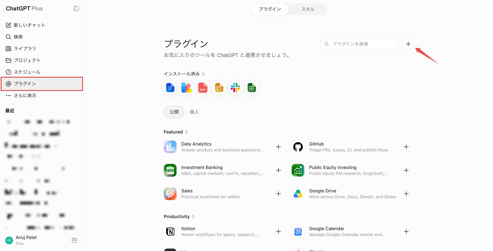
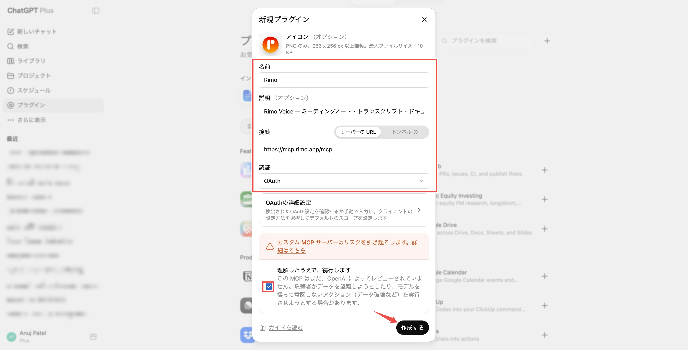
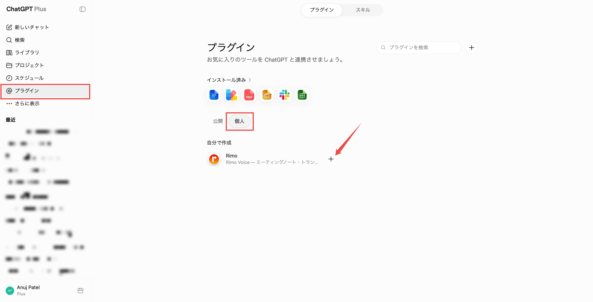
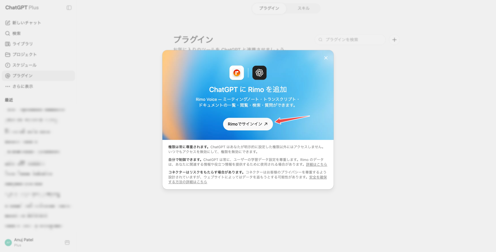
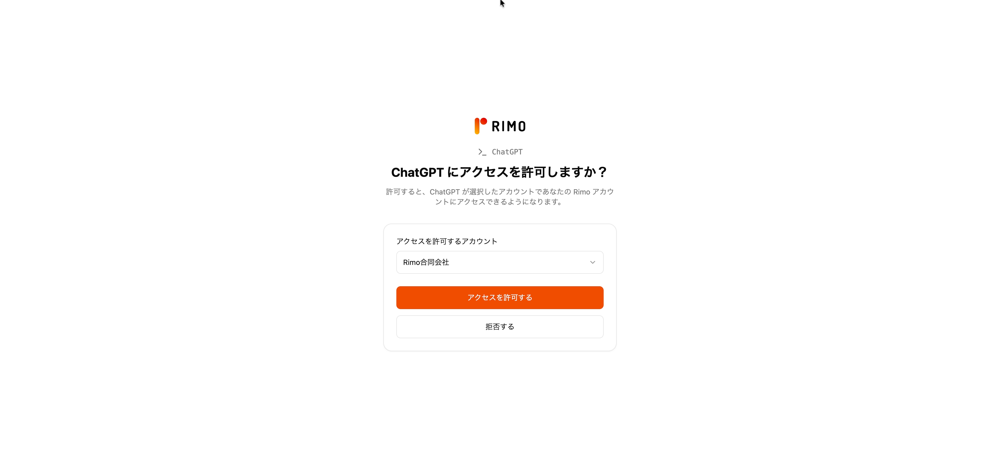
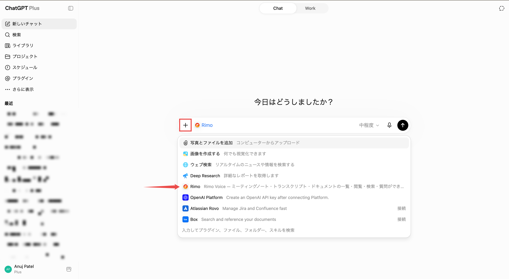
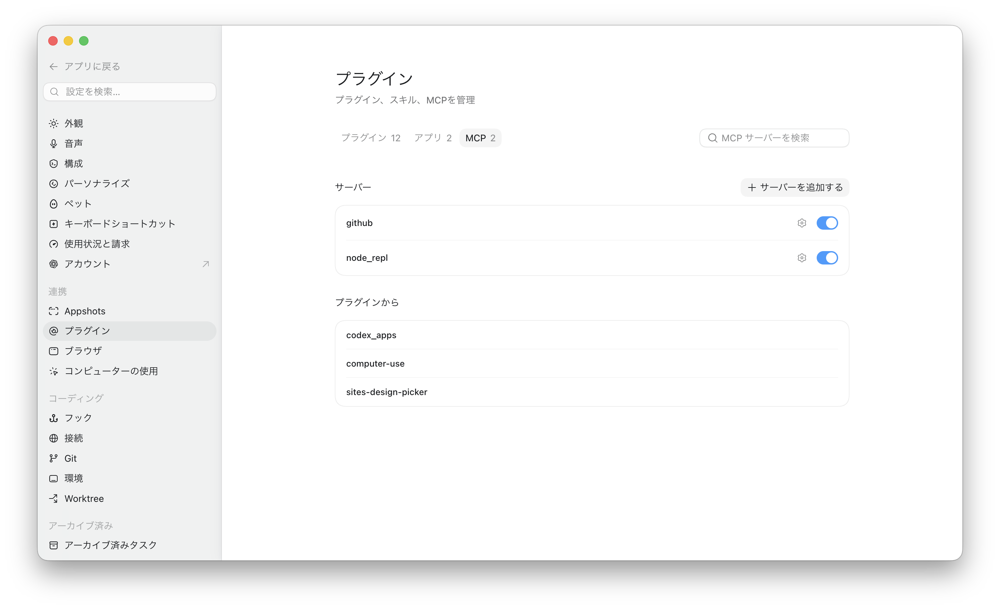
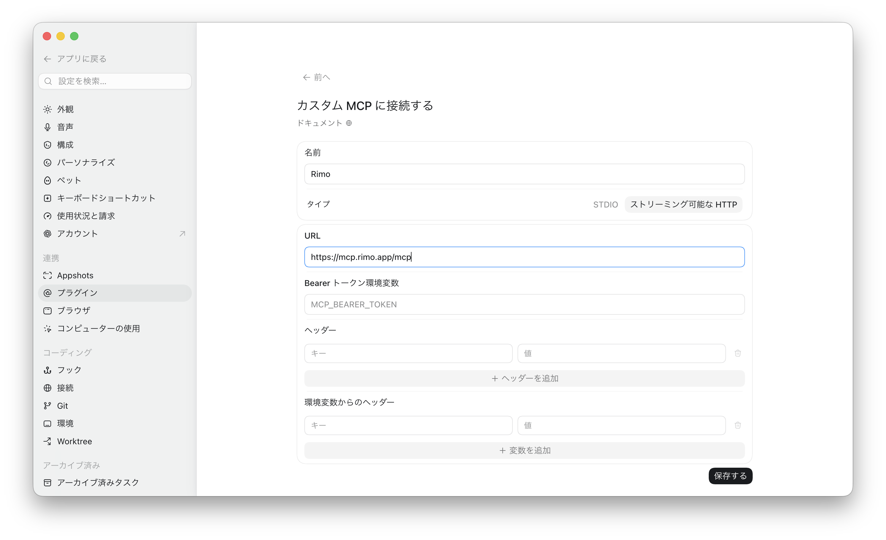
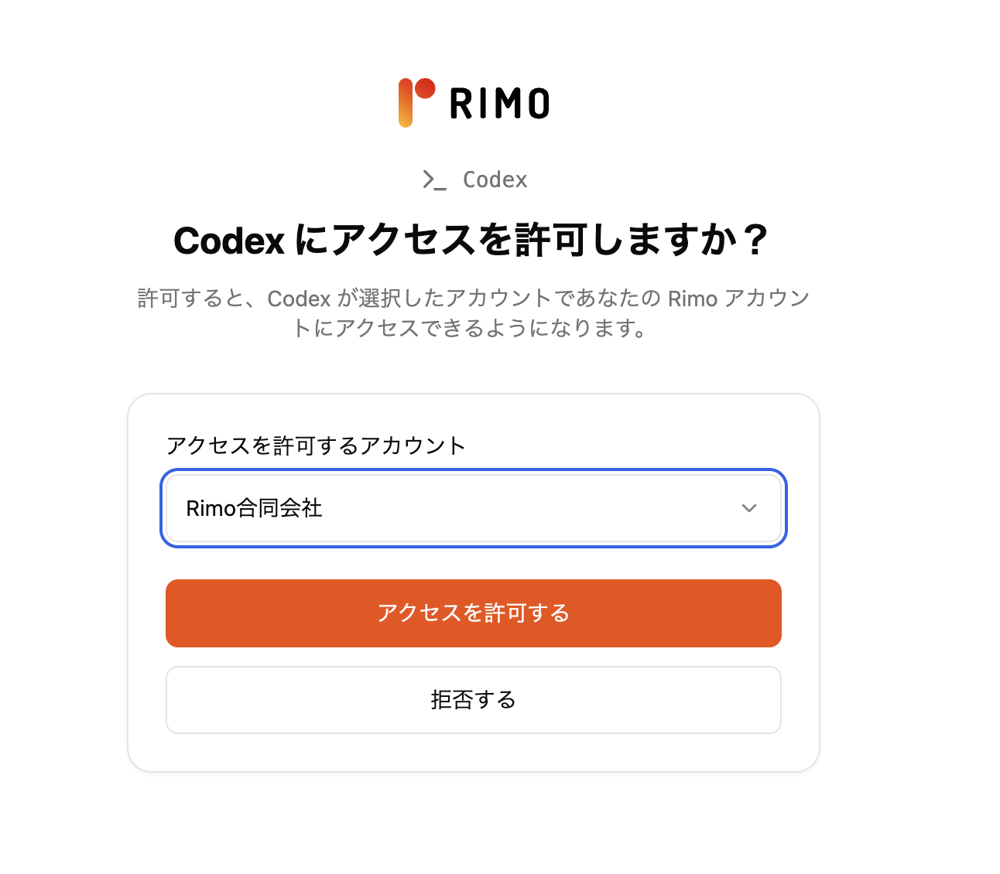

# ChatGPT で Rimo を使う

[English](../en/rimo-in-chatgpt.md) | [日本語](../ja/rimo-in-chatgpt.md)

Rimo を **ChatGPT** につなぐと、チャットの中でそのまま自分のミーティングノートについて質問できます。ChatGPT が Rimo を調べて答えてくれます。

- *「Rimo のノートで、月曜の打ち合わせで何が決まった？」*
- *「Rimo の先週のクライアント面談を要約して。」*

**インストールするものはありません。** ChatGPT にリンクを 1 つ追加し、ブラウザでいつもの Rimo アカウントにサインインするだけです。

**追加するリンク:**

```
https://mcp.rimo.app/mcp
```

> Claude または Microsoft Copilot をお使いですか? [Claude で Rimo を使う](rimo-in-claude.md) または [Microsoft Copilot で Rimo を使う](rimo-in-microsoft.md) を参照してください。自分のマシンのコーディングツール（Claude Code、Cursor、Codex）の場合は [コーディングツールで使う](setup-guide.md) を参照してください。

---

## はじめる前に

- **Rimo アカウント** — いつもサインインしているものと同じ。チーム／組織に所属していること。
- カスタム MCP プラグインが使える ChatGPT のプラン（**Web 版**）:
  - **Plus / Pro** — 開発者モードを自分でオンにできます。
  - **Business / Enterprise / Education** — まず管理者がワークスペースでカスタムコネクターを許可し、その後で各メンバーが開発者モードをオンにします。

Rimo のパスワードやキーを ChatGPT に入力することはありません。サインインは、ブラウザ上の Rimo 自身のページで行います。

---

<a id="turn-on-developer-mode"></a>

## 開発者モードをオンにする

カスタム MCP プラグインは **開発者モード（Developer mode）** の中にあります。**オンのままにしておく必要があります** — オフにすると、チャットで Rimo が使えなくなります。オン／オフの切り替えだけで、コードを書く必要はありません。

### Plus / Pro — 自分でオンにする

1. ChatGPT で **設定（Settings）→ セキュリティとログイン（Security and login）** を開きます。
2. **開発者モード（Developer mode）** をオンにします。

### Business / Enterprise / Education — まず管理者が有効化する

1. **管理者** がワークスペース全体でカスタムコネクターを有効化します（**ワークスペース設定（Workspace Settings）→ Permissions & Roles → Connected Data → Developer mode / Create custom MCP connectors**）。
2. その後、各メンバーが自分で **開発者モード（Developer mode）** をオンにします（**設定 → セキュリティとログイン → 開発者モード**）。

---

## Rimo プラグインを追加する

1. **設定（Settings）→ プラグイン（Plugins）** を開きます（または [chatgpt.com/plugins](https://chatgpt.com/plugins) にアクセスします）。
2. 右上の **＋** をクリックします。

   

3. **新規アプリ（New App）** ダイアログに入力します。
   - **名前（Name）:** `Rimo`
   - **説明（Description）:** `Rimo Voice — ミーティングノート・文字起こし・ドキュメントの一覧・閲覧・検索・質問ができます。`
   - **接続（Connection）:** **サーバー URL（Server URL）** のまま `https://mcp.rimo.app/mcp` を入力します
   - **認証（Authentication）:** **OAuth**（**詳細 OAuth 設定（Advanced OAuth settings）** はそのままで構いません）
   - **理解した上で続行する（I understand and want to continue）** にチェックを入れます。

   

4. **作成（Create）** をクリックします。Rimo プラグインが **プラグイン → 個人用（Personal）→ 自分が作成（Created by me）** に表示されます。

---

<a id="sign-in-to-rimo"></a>

## Rimo にサインインする

1. **プラグイン → 個人用 → 自分が作成** で、**Rimo** の横の **＋** をクリックして追加します。

   

2. **Add Rimo to ChatGPT** の画面で **Sign in with Rimo（Rimo でサインイン）** をクリックします。ChatGPT が Rimo 自身のサインインページをブラウザで開きます。

   

3. **Rimo にサインイン** します（いつものアカウント）。
4. **組織を選んで承認します。** ChatGPT がアクセスを要求していることと、どの **組織** を見てよいかが表示されます。組織を 1 つ選ぶと **承認（アクセスを許可する）** が押せるようになります（選ぶまではグレーのまま）。**承認** をクリックしてください。（**拒否する** でキャンセルします。）

   

> プラグインを削除しない限り、再度行う必要はありません。

---

## チャットで使う

1. 新しい会話を始めます。
2. メッセージ入力欄の近くにある **＋** ボタンをクリックします。
3. メニューから **Rimo** を選びます。

   

4. 質問します。例：*「価格に関する議論を Rimo のノートから検索して、決まったことを教えて。」*

---

## Codex で使う

**Codex**（ChatGPT のサイドバーにある OpenAI のコーディングエージェント）も、同じホスト型 Rimo サーバーに接続できます。ただしプラグインではなく **MCP サーバー** として追加します。**開発者モード（Developer mode）** はオンにしておく必要があります（上記「[開発者モードをオンにする](#turn-on-developer-mode)」を参照）。

1. Codex のサイドバーで **プラグイン（Plugins）** をクリックします。
2. **MCP** をクリックします。

   

3. 新しい MCP サーバーを追加し、次のように入力します。
   - **タイプ（Type）:** **ストリーミング可能な HTTP（Streamable HTTP）**
   - **名前（Name）:** `Rimo`
   - **URL:** `https://mcp.rimo.app/mcp`

   

4. 保存したら、**Rimo でサインインして組織を承認します** — 上記「[Rimo にサインインする](#sign-in-to-rimo)」と同じ、ブラウザでのサインインです。

   

接続できたら、通常のチャットと同じように Codex にノートについて質問できます。

> これは **ChatGPT 内の Codex エージェント**（ホスト型サーバー）です。自分のマシンで動かす Codex **CLI**（`~/.codex/config.toml` でローカルに `rimo mcp` を登録する方法）は [コーディングツールで使う](setup-guide.md) を参照してください。

---

## 質問の例

- 「今週の Rimo のノートを見せて。」
- 「先週のスプリントで参加した Rimo のミーティングは？」
- 「直近の Rimo ミーティングの文字起こしを取得して。」
- 「そのミーティングには誰がいた？」
- 「価格戦略に関する Rimo のノートを探して。」
- 「オンボーディングに関するノートを探して。直接オンボーディングという単語がなくても関連するものは含めて。」
- 「Rimo のノートを見て、Q3 リリースについて何を決めたか教えて。」

Rimo は、**あなた自身が Rimo で閲覧権限があるもの** しか ChatGPT に見せません。

---

## 組織の切り替えと停止

- **一度に 1 つの組織。** 接続は、サインイン時に選んだ 1 つの組織を対象にします。別の組織を使いたい場合は、プラグインを削除してもう一度作成し、そのときに別の組織を選びます。
- **いつでも停止できる。** ChatGPT で Rimo プラグインを削除すれば解除されます。アクセスはその後まもなく停止します。

---

## うまくいかないとき

**「プラグイン」や作成用の「＋」が見つからない。** カスタム MCP プラグインには Plus / Pro / Business / Enterprise / Education のプラン（Web 版）が必要で、**開発者モード（Developer mode）** をオンにしておく必要があります（**設定 → セキュリティとログイン → 開発者モード**）。Business / Enterprise / Education のワークスペースでは、管理者が先にカスタムコネクターを許可する必要があります。ChatGPT ワークスペースの管理者に相談してください。

**チャットで Rimo が使えない。** **開発者モード（Developer mode）** がオンのままか確認してください（**設定 → セキュリティとログイン**）。オフにするとカスタム MCP プラグインが無効になり、オンに戻すまで Rimo はチャットから消えます。

**サインインはできるが「承認」がグレーのまま。** サインイン画面で、まず組織を選んでください。選ぶと **承認** が押せるようになります。

**存在するはずのノートを ChatGPT が見つけられない。** ChatGPT は、接続した 1 つの組織の中で、あなた自身のアカウントで閲覧権限のあるものしか参照しません。別の組織にあるノートなら、再接続してその組織を選んでください。同僚から共有されていないノートは表示されません。

---

## ChatGPT 公式ヘルプ

- [Developer mode and MCP apps in ChatGPT](https://help.openai.com/en/articles/12584461-developer-mode-and-mcp-apps-in-chatgpt)
- [Connect from ChatGPT (OpenAI developer docs)](https://developers.openai.com/apps-sdk/deploy/connect-chatgpt)

---

## 関連ページ

- [Claude で Rimo を使う](rimo-in-claude.md) — Claude 向けの同じ手順
- [Microsoft Copilot で Rimo を使う](rimo-in-microsoft.md) — DCR で Copilot Studio エージェントに接続する
- [認証](authentication.md) — Rimo のサインインとアカウントの仕組み
