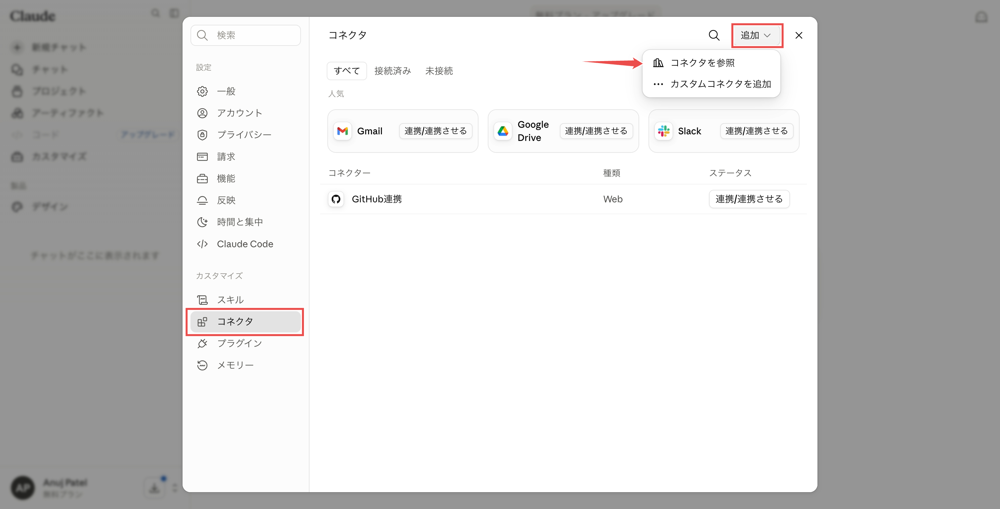
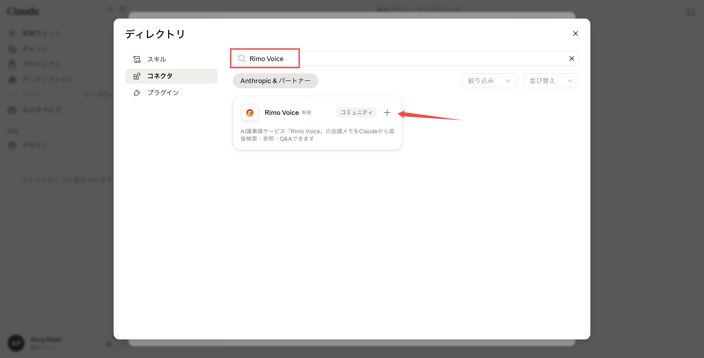
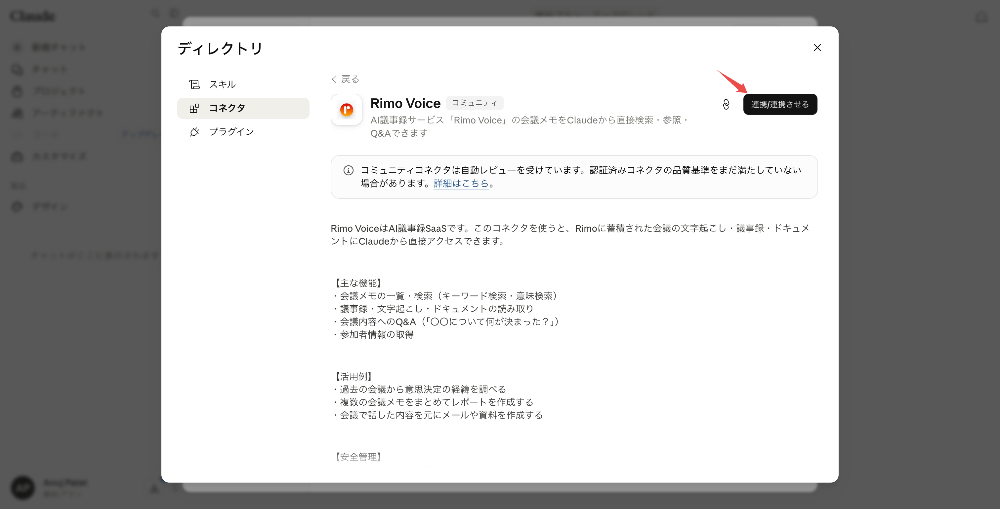
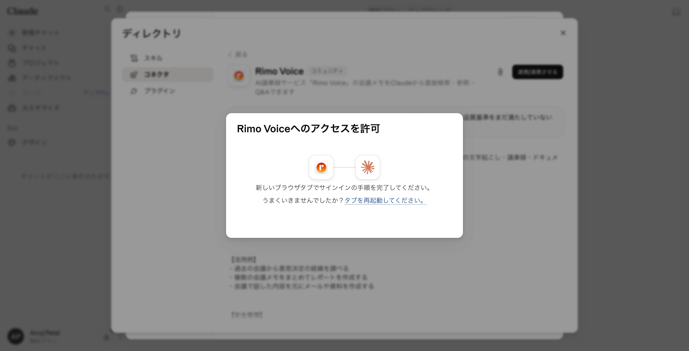
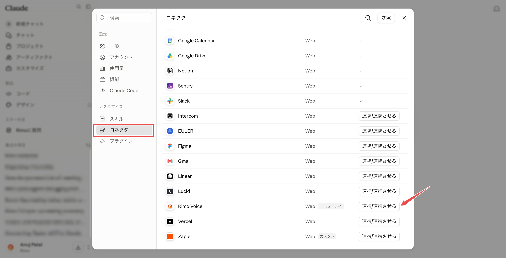
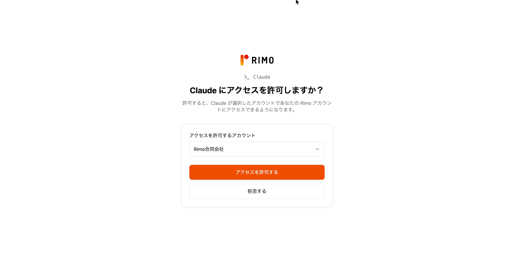
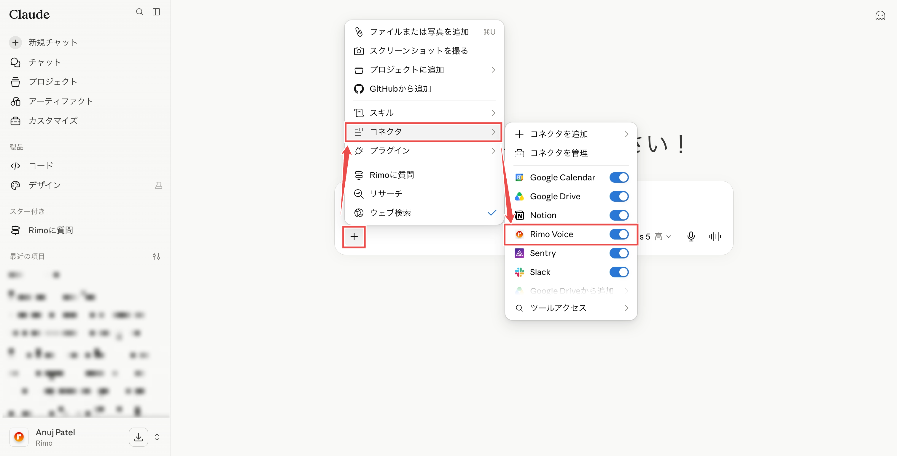
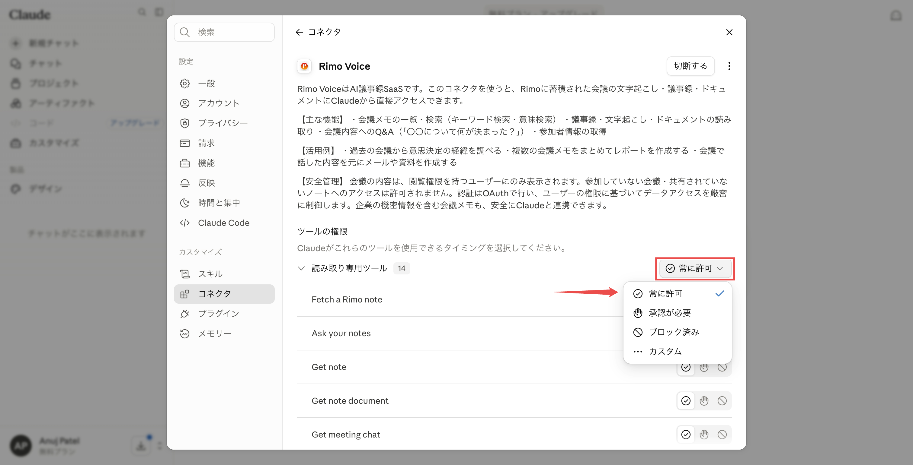
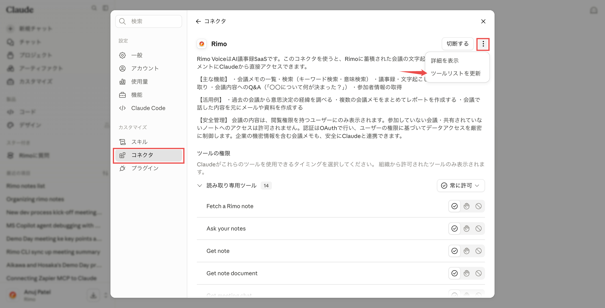

# Claude で Rimo を使う

[English](../en/rimo-in-claude.md) | [日本語](../ja/rimo-in-claude.md)

Rimo を **Claude** につなぐと、チャットの中でそのまま自分のミーティングノートについて質問できます。Claude が Rimo を調べて答えてくれます。

- *「Rimo のノートで、月曜の打ち合わせで何が決まった？」*
- *「Rimo の先週のクライアント面談を要約して。」*

**Rimo Voice** は Claude のコネクタディレクトリに掲載されています。Claude 内で見つけて **連携** をクリックし、ブラウザでいつもの Rimo アカウントにサインインするだけです。

以下のリンクを開くと Rimo Voice のページ（**連携** ボタンのある画面）に直接移動できます。

```
https://claude.ai/directory/connectors/rimo-voice
```

以下の手順は、ブラウザの **claude.ai** でも **Claude デスクトップアプリ** でも同じです。コネクタは Claude アカウントに紐づくため、一度設定すればどちらでも使えます。

> ChatGPT または Microsoft Copilot をお使いですか? [ChatGPT で Rimo を使う](rimo-in-chatgpt.md) または [Microsoft Copilot で Rimo を使う](rimo-in-microsoft.md) を参照してください。自分のマシンのコーディングツール（Claude Code、Cursor、Codex）の場合は [コーディングツールで使う](setup-guide.md) を参照してください。

---

## はじめる前に

- **Rimo アカウント** — いつもサインインしているものと同じものをご利用いただけます。
- Claude アカウント。ディレクトリのコネクタは Claude の **Free / Pro / Max / Team / Enterprise** の各プランで使えます。
  - **Free / Pro / Max** — 自分で接続できます。
  - **Team / Enterprise** — 管理者が組織に対して Rimo Voice を有効化し、その後、各メンバーが **連携** をクリックします。

> Rimo のパスワードやキーを Claude に入力することはありません。サインインは、ブラウザ上の Rimo 自身のページで行います。

---

## Rimo Voice に接続する

### Claude で Free / Pro / Max プランを利用されている場合

> ショートカット: [claude.ai/directory/connectors/rimo-voice](https://claude.ai/directory/connectors/rimo-voice) を開くと、手順 4 の掲載ページに直接移動できます（手順 1〜3 は不要です）。

1. Claude で **[カスタマイズ（Customize）→ コネクタ（Connectors）](https://claude.ai/customize/connectors)** を開きます。
2. コネクタページ右上の **追加（Add）** ボタンをクリックし、**コネクタを参照（Browse connectors）** を選びます。

   

3. **Rimo Voice** を検索して、表示された項目を開きます。

   

4. **連携** をクリックします。

   

5. 新しいブラウザタブで Rimo 自身のサインインページが開きます — [Rimo にサインインする](#rimo-にサインインする) を参照してください。サインインが終わるまで、Claude 側は **Rimo Voice へのアクセスを許可** のダイアログで待機します。

   

### Claude で Team / Enterprise プランを利用されている場合

#### ステップ 1 — 管理者が組織に対して Rimo Voice を有効化する（一度だけ）

1. **[管理者設定（Admin settings）→ コネクタ（Connectors）](https://claude.ai/admin-settings/connectors)** を開きます。
2. ディレクトリから **Rimo Voice** を見つけて、組織に対して有効化します。

   <!-- screenshot: ../images/assets/ja/claude-org-add.png — 管理者設定 → コネクタ。ディレクトリの Rimo Voice と有効化の操作をマーク -->

このページが表示されない場合は、Claude ワークスペースの管理者に依頼してください。組織へのコネクタの有効化には管理者権限が必要です（[Claude 公式ガイド](https://support.claude.com/en/articles/11176164-use-connectors-to-extend-claude-s-capabilities) 参照）。

#### ステップ 2 — 各メンバーが接続する（メンバーごとに一度）

1. **[カスタマイズ → コネクタ](https://claude.ai/customize/connectors)** を開きます。
2. 一覧から **Rimo Voice** コネクタを見つけて **連携** をクリックします。

   

3. ブラウザタブが開きます — [Rimo にサインインする](#rimo-にサインインする) を参照してください。

> **Team プランで、コネクタを有効化する権限がない場合は?** ディレクトリに接続の操作ではなく **リクエスト（Request）** が表示されます。クリックすると組織の管理者にリクエストが届き、保留中はボタンが **リクエスト済み（Requested）** に変わります。結果は次にディレクトリを開いたときに Claude が知らせてくれます。

---

## Rimo にサインインする

Rimo Voice に接続すると、Claude が Rimo 自身のサインインページをブラウザタブで開きます。

1. **Rimo にサインイン** します（いつものアカウント）。
2. **組織を選びます。** Claude がアクセスを要求していることと、どの **組織** を見てよいかが表示されます。組織を選ぶまで **承認（Approve）** はグレーのままです。
3. **承認** をクリックします。（**拒否（Deny）** でキャンセルします。）

   

接続を解除しない限り、再度行う必要はありません。

---

## チャットで有効にする

1. 会話の中で、チャット入力欄の左下にある **＋** ボタンをクリックします。
2. **コネクタ（Connectors）** を選んで **Rimo Voice** をオンにします。

   

3. あとは質問するだけです。例：*「価格に関する議論を Rimo のノートから検索して、決まったことを教えて。」*

---

## すべてのツールを一度に許可する

接続後、Claude は各ツールを初めて使うときに許可を求めてきます。まとめて許可しておきたい場合は、次のように設定します。

1. **[カスタマイズ → コネクタ](https://claude.ai/customize/connectors)** を開き、**Rimo Voice** をクリックします。
2. **ツールの権限（Tool permissions）** で、**読み取り専用ツール** のグループを **常に許可（Always allow）** に設定します。

   

Rimo Voice のツールはすべて読み取り専用で、Rimo 側のデータを変更するものはありません。同じ一覧から、個別のツールを **承認が必要（Needs approval）** や **ブロック済み（Blocked）** にすることもできます。

---

## ツールリストを更新する

Rimo では時々、新しいツールが追加されます。Claude に最新のツールが表示されないときは、リストを更新してください。

1. **[カスタマイズ → コネクタ](https://claude.ai/customize/connectors)** を開き、**Rimo Voice** をクリックします。
2. 右上（**切断する** の隣）の **⋯** メニューを開き、**ツールリストを更新（Refresh tools list）** を選びます。

   

---

## 質問の例

- 「今週の Rimo のノートを見せて。」
- 「先週のスプリントで参加した Rimo のミーティングは？」
- 「直近の Rimo ミーティングの文字起こしを取得して。」
- 「そのミーティングには誰がいた？」
- 「価格戦略に関する Rimo のノートを探して。」
- 「オンボーディングに関するノートを探して。直接オンボーディングという単語がなくても関連するものは含めて。」
- 「Rimo のノートを見て、Q3 リリースについて何を決めたか教えて。」

Rimo は、**あなた自身が Rimo で閲覧権限があるもの** しか Claude に見せません。

---

## 組織の切り替えと停止

- **一度に 1 つの組織。** 接続は、サインイン時に選んだ 1 つの組織を対象にします。別の組織を使いたい場合は、接続を解除してからもう一度接続し、そのときに別の組織を選んでください。
- **いつでも停止できる。** **[カスタマイズ → コネクタ](https://claude.ai/customize/connectors)** を開き、**Rimo Voice** をクリックして **切断する（Disconnect）** をクリックします。

---

## うまくいかないとき

**ディレクトリで Rimo Voice が見つからない。** `Rimo` だけでなく `Rimo Voice` で検索し、ディレクトリの **コネクタ** タブ（スキルやプラグインではなく）を見ているか確認してください。[claude.ai/directory/connectors/rimo-voice](https://claude.ai/directory/connectors/rimo-voice) から掲載ページを直接開くこともできます。Team / Enterprise では、まず管理者が組織に対して有効化する必要があります。**リクエスト** が表示される場合は、クリックして依頼してください。

**サインインはできるが「承認」がグレーのまま。** サインイン画面で、まず組織を選んでください。選ぶと **承認** が押せるようになります。

**存在するはずのノートを Claude が見つけられない。** Claude は、接続した 1 つの組織の中で、あなた自身のアカウントで閲覧権限のあるものしか参照しません。別の組織にあるノートなら、再接続してその組織を選んでください。同僚から共有されていないノートは表示されません。

---

## Claude 公式ヘルプ

- [Connectors directory](https://claude.com/docs/connectors/directory)
- [Use connectors to extend Claude's capabilities](https://support.claude.com/en/articles/11176164-use-connectors-to-extend-claude-s-capabilities)

---

## 関連ページ

- [ChatGPT で Rimo を使う](rimo-in-chatgpt.md) — ChatGPT 向けの同じ手順
- [Microsoft Copilot で Rimo を使う](rimo-in-microsoft.md) — DCR で Copilot Studio エージェントに接続する
- [認証](authentication.md) — Rimo のサインインとアカウントの仕組み
