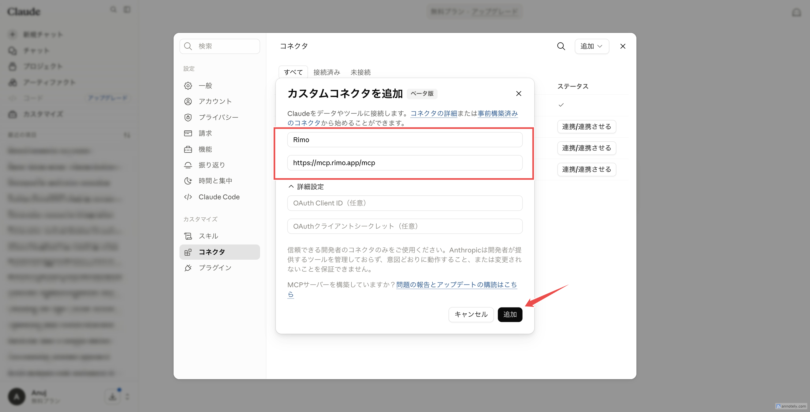

# Claude で Rimo を使う

[English](../en/rimo-in-claude.md) | [日本語](../ja/rimo-in-claude.md)

Rimo を **Claude** につなぐと、チャットの中でそのまま自分のミーティングノートについて質問できます。Claude が Rimo を調べて答えてくれます。

- *「Rimo のノートで、月曜の打ち合わせで何が決まった？」*
- *「Rimo の先週のクライアント面談を要約して。」*

**インストールするものはありません。** Claude にリンクを 1 つ追加し、ブラウザでいつもの Rimo アカウントにサインインするだけです。

**追加するリンク:**

```
https://mcp.rimo.app/mcp
```

以下の手順は、ブラウザの **claude.ai** でも **Claude デスクトップアプリ** でも同じです。コネクターは Claude アカウントに紐づくため、一度設定すればどちらでも使えます。

> ChatGPT または Microsoft Copilot をお使いですか? [ChatGPT で Rimo を使う](rimo-in-chatgpt.md) または [Microsoft Copilot で Rimo を使う](rimo-in-microsoft.md) を参照してください。自分のマシンのコーディングツール（Claude Code、Cursor、Codex）の場合は [コーディングツールで使う](setup-guide.md) を参照してください。

---

## はじめる前に

- **Rimo アカウント** — いつもサインインしているものと同じ。組織に所属していること。
- Claude アカウント。カスタムコネクターは **Free / Pro / Max / Team / Enterprise** の各プランで使えます。
  - **Free** — カスタムコネクターを **1 つ** 追加できます（それを Rimo にします）。
  - **Pro / Max** — 自分で追加できます。
  - **Team / Enterprise** — オーナーが組織に対して一度追加し、その後、各メンバーが **接続（Connect）** をクリックします。

> Rimo のパスワードやキーを Claude に入力することはありません。サインインは、ブラウザ上の Rimo 自身のページで行います。

---

## コネクターを設定する

### Free / Pro / Max — 自分で追加する

1. Claude で **[カスタマイズ（Customize）→ コネクター（Connectors）](https://claude.ai/customize/connectors)** を開きます。
2. コネクターページ右上の **追加（Add）** ボタンをクリックし、**カスタムコネクターを追加（Add custom connector）** を選びます。

   

3. ダイアログに入力します。
   - **名前（Name）:** `Rimo`
   - **URL:** `https://mcp.rimo.app/mcp`
   - **詳細設定（Advanced settings）**（OAuth Client ID / Secret）は空のままにしてください。Rimo はブラウザでサインインします。

   

4. **追加（Add）** をクリックします。ブラウザが開きます — [Rimo にサインインする](#rimo-にサインインする) を参照してください。

**Free** プランではカスタムコネクターを 1 つ持てます。それを Rimo にしてください。

### Team / Enterprise — オーナーが追加し、各メンバーが接続する

#### ステップ 1 — オーナーが組織に Rimo を追加する（一度だけ）

**オーナー（Owner）** は Claude ワークスペースのロールです。**組織設定（Organization settings）** はオーナーにしか表示されません（[Claude 公式ガイド](https://support.claude.com/en/articles/11175166-get-started-with-custom-connectors-using-remote-mcp) 参照）。自分がオーナーでない場合は、Claude ワークスペースの管理者に依頼してください。

1. **組織設定（Organization settings）→ コネクター** を開きます。
2. **追加（Add）** をクリックし、**カスタム（Custom）** にカーソルを合わせ、**Web** を選びます。
3. ダイアログに入力します。
   - **名前（Name）:** `Rimo`
   - **URL:** `https://mcp.rimo.app/mcp`
   - **詳細設定（Advanced settings）** は空のままにしてください。
4. **追加（Add）** をクリックします。

   <!-- screenshot: ../images/assets/ja/claude-org-add.png — 組織設定 → コネクター。「追加」→「カスタム」→「Web」をマーク -->

#### ステップ 2 — 各メンバーが接続する（メンバーごとに一度）

1. **[カスタマイズ → コネクター](https://claude.ai/customize/connectors)** を開きます。
2. **Rimo** コネクターを見つけます（**Custom** と表示されています）。
3. **接続（Connect）** をクリックします。ブラウザが開きます — [Rimo にサインインする](#rimo-にサインインする) を参照してください。

   

---

## Rimo にサインインする

Rimo を追加または接続すると、Claude が Rimo 自身のサインインページをブラウザで開きます。

1. **Rimo にサインイン** します（いつものアカウント）。
2. **組織を選びます。** Claude がアクセスを要求していることと、どの **組織** を見てよいかが表示されます。組織を選ぶまで **承認（Approve）** はグレーのままです。
3. **承認** をクリックします。（**拒否（Deny）** でキャンセルします。）

   

接続を解除しない限り、再度行う必要はありません。

---

## チャットで有効にする

1. 会話の中で、チャット入力欄の左下にある **＋** ボタンをクリックします。
2. **コネクター（Connectors）** を選んで **Rimo** をオンにします。

   

3. あとは質問するだけです。例：*「価格に関する議論を Rimo のノートから検索して、決まったことを教えて。」*

---

## ツールリストを更新する

Rimo では時々、新しいツールが追加されます。Claude に最新のツールが表示されないときは、リストを更新してください。

1. **[カスタマイズ → コネクター](https://claude.ai/customize/connectors)** を開き、**Rimo** をクリックします。
2. 右上の **⋯** メニューを開き、**ツールリストを更新（Refresh tools list）** を選びます。

   

---

## 質問の例

- 「今週の Rimo のノートを見せて。」
- 「先週のスプリントで参加した Rimo のミーティングは？」
- 「直近の Rimo ミーティングのトランスクリプトを取得して。」
- 「そのミーティングには誰がいた？」
- 「価格戦略に関する Rimo のノートを探して。」
- 「オンボーディングに関するノートを探して。その言葉を使っていないものも含めて。」
- 「Rimo のノートを見て、Q3 リリースについて何を決めたか教えて。」

Rimo は、**あなた自身が Rimo で見られるもの** しか Claude に見せません。

---

## 組織の切り替えと停止

- **一度に 1 つの組織。** 接続は、サインイン時に選んだ 1 つの組織を対象にします。別の組織を使いたい場合は、コネクターを削除してもう一度追加し、そのときに別の組織を選びます。
- **いつでも停止できる。** Claude で Rimo コネクターを削除すれば解除されます。アクセスはその後まもなく停止します。

---

## うまくいかないとき

**コネクターを追加する場所が見つからない。** カスタムコネクターは Free / Pro / Max / Team / Enterprise で使え、[claude.ai/customize/connectors](https://claude.ai/customize/connectors) から追加します。Free では 1 つ持てます。Team / Enterprise ではオーナーのみが追加できます。Claude ワークスペースのオーナーに相談してください。

**サインインはできるが「承認」がグレーのまま。** サインイン画面で、まず組織を選んでください。選ぶと **承認** が押せるようになります。

**存在するはずのノートを Claude が見つけられない。** Claude は、接続した 1 つの組織の中で、あなた自身のアカウントに見えるものしか参照しません。別の組織にあるノートなら、再接続してその組織を選んでください。同僚から共有されていないノートは表示されません。

---

## Claude 公式ヘルプ

- [Get started with custom connectors using remote MCP](https://support.claude.com/en/articles/11175166-get-started-with-custom-connectors-using-remote-mcp)
- [Use connectors to extend Claude's capabilities](https://support.claude.com/en/articles/11176164-use-connectors-to-extend-claude-s-capabilities)

---

## 関連ページ

- [ChatGPT で Rimo を使う](rimo-in-chatgpt.md) — ChatGPT 向けの同じ手順
- [Microsoft Copilot で Rimo を使う](rimo-in-microsoft.md) — DCR で Copilot Studio エージェントに接続する
- [認証](authentication.md) — Rimo のサインインとアカウントの仕組み
