# Microsoft Copilot で Rimo を使う

[English](../en/rimo-in-microsoft.md) | [日本語](../ja/rimo-in-microsoft.md)

Rimo を **Microsoft Copilot Studio のエージェント** につなぐと、Microsoft Teams や Microsoft 365 Copilot の中で自分のミーティングノートについて質問できます。エージェントが Rimo を調べて答えてくれます。

- *「Rimo のノートで、月曜の打ち合わせで何が決まった？」*
- *「Rimo の先週のクライアント面談を要約して。」*

Rimo は、Copilot Studio エージェントに **ツール**（ホスト型の MCP サーバー）として追加します。エージェント作成者が一度 Rimo を追加すれば、エージェントの公開後は各従業員がそれを開いて、自分の Rimo アカウントでサインインするだけです。

**追加するサーバー URL:**

```
https://mcp.rimo.app/mcp
```

> **すでに Copilot Studio エージェントをお持ちですか?** 新しく作る必要はありません。**[エージェントに Rimo MCP を追加する](#add-rimo-mcp-to-your-agent)** に直接進み、その後テストと公開に戻ってください。

> Claude または ChatGPT をお使いですか? [Claude で Rimo を使う](rimo-in-claude.md) または [ChatGPT で Rimo を使う](rimo-in-chatgpt.md) を参照してください。

---

## Microsoft の組織向けセットアップの仕組み

大きく分けて 3 つのパートがあります。

1. **エージェント作成者**（エージェントを作成・管理する人）が Copilot Studio エージェントを 1 つ作り、Rimo MCP をツールとして追加します。
2. **管理者** が公開されたエージェントを承認し、組織全体から見つけられるようにします。
3. 各 **エンドユーザー** がエージェントを開いて Rimo にサインインします。

Rimo は **ユーザーごとの認証** を使います。各ユーザーは、自分の Rimo アカウントで閲覧権限があるノートしか参照できません。誰かが初めて Rimo を必要とする質問をすると、Copilot Studio がその人に Rimo へのサインインを求めます。その後は接続が有効なままになり、期限切れや切断が起きたときだけ再度サインインが求められます。[Microsoft のユーザー認証ガイド](https://learn.microsoft.com/ja-jp/microsoft-copilot-studio/configure-enduser-authentication) を参照してください。

ここで説明する組織向けの展開では、Microsoft のアカウントは **同じ Microsoft Entra テナント** に属している必要があります。各ユーザーには **自分の Rimo アカウント** も必要です。Microsoft のメールアドレスと Rimo のメールアドレスは一致している必要はありません（一致していても問題はなく、違いはありません）。

---

## Copilot Studio エージェントを作成する

すでにエージェントをお持ちの場合はこのセクションを飛ばして、[エージェントに Rimo MCP を追加する](#add-rimo-mcp-to-your-agent) に進んでください。

1. [Microsoft Copilot Studio](https://copilotstudio.microsoft.com/) にサインインし、使いたい環境を選びます。
2. **ホーム（Home）** または **エージェント（Agents）** のページで、作りたいものを自分の言葉で説明するか、**空のエージェントを作成（Create blank agent）** を選んで説明を省略します。Copilot Studio がエージェントを準備し、その **概要（Overview）** ページを開きます。
3. **詳細（Details）** セクションでエージェントの名前を設定します（例: `Rimo Voice`）。**指示（Instructions）** セクションで動作を記述します — 下記の [推奨するエージェントの指示](#recommended-agent-instructions) を参照してください。
4. Copilot Studio はエージェントを **Microsoft Entra ID** 認証用に自動で構成します。オンのままにしてください。

詳しい手順は [エージェントの作成と編集](https://learn.microsoft.com/ja-jp/microsoft-copilot-studio/authoring-first-bot) を参照してください。

<a id="recommended-agent-instructions"></a>

### 推奨するエージェントの指示

明確な指示があると、エージェントは Rimo に基づいて回答し、事実でない内容を作り出さなくなります。次のような内容をエージェントの **指示（Instructions）** に貼り付け、必要に応じて調整してください。

```text
あなたは、サインイン中のユーザーが自分の Rimo ミーティングノートから情報を見つけ、理解するのを手伝います。接続されたツールを通じて Rimo に読み取り専用でアクセスでき、参照できる範囲はユーザーの Rimo アカウントと組織によって決まります。

- ユーザーのミーティング、ノート、文字起こし、決定事項、参加者、ドキュメントに関することは、回答する前に必ず Rimo のツールを呼び出してください。
- 回答は Rimo のツールが返した内容だけに基づいてください。ツールの結果に含まれない情報は「わからない」と答え、推測や創作をしないでください。
- 関連する情報が見つからない場合は、その旨を明確に伝えてください。Rimo へのアクセスは読み取り専用です。ノートを作成・編集・共有・削除したと述べないでください。
- ミーティング・人物・チーム・日付が曖昧な場合は、先に短い確認の質問を 1 つしてください。
- 簡潔に答えてください。まず結論を述べ、続いて根拠を簡潔に示し、参照したノートのタイトルとミーティング日を挙げてください。
```

---

<a id="add-rimo-mcp-to-your-agent"></a>

## エージェントに Rimo MCP を追加する

以下のセットアップは、エージェント作成者がエージェントの **ビルド（Build）** ビューで一度だけ行います。

1. 右側のパネルで **ツール（Tools）** を開きます。

   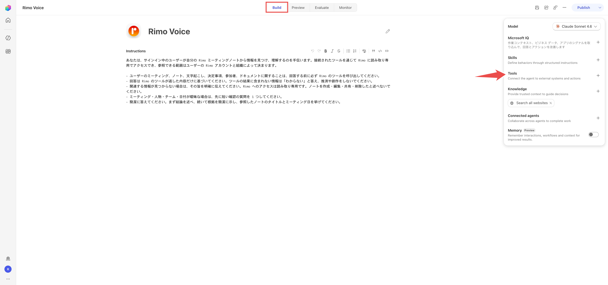

2. **ツールの追加（Add a tool）** を選びます。ダイアログで右上の **＋ 追加（Add）** を選び、**モデル コンテキスト プロトコル (MCP)** を選択します。

   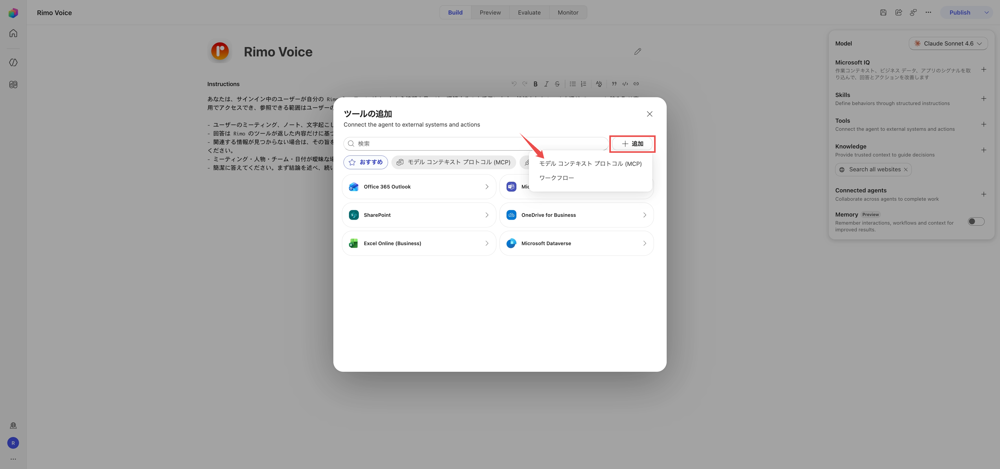

3. サーバーの詳細を入力します。
   - **サーバー名（Server name）:** `Rimo`
   - **サーバーの説明（Server description）:** `Rimo — list, read, search, and ask across your meeting notes, transcripts, and documents.`
   - **サーバー URL（Server URL）:** `https://mcp.rimo.app/mcp`
   - **認証（Authentication）:** **OAuth 2.0**
   - **構成の種類（Configuration type）:** **動的 (検出あり)**

   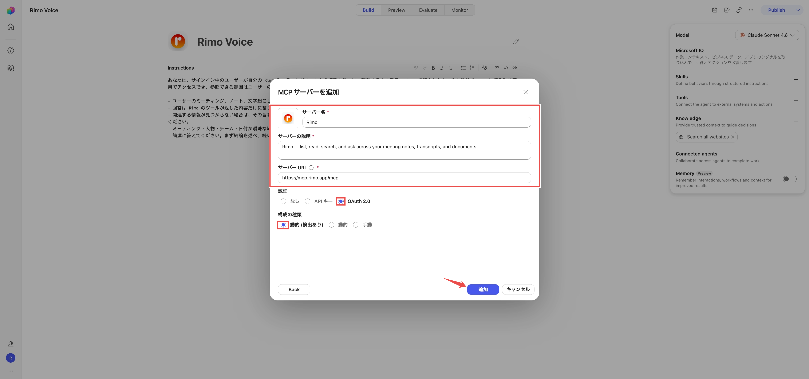

4. **追加（Add）** を選びます。Copilot Studio が接続を求めたら接続を作成し（[エージェント作成者として Rimo にサインインする](#sign-in-to-rimo-as-the-maker) を参照）、もう一度 **追加（Add）** を選んでエージェントに追加します。

[既存の MCP サーバーを Copilot Studio エージェントに接続する](https://learn.microsoft.com/ja-jp/microsoft-copilot-studio/mcp-add-existing-server-to-agent) を参照してください。

---

<a id="sign-in-to-rimo-as-the-maker"></a>

## エージェント作成者として Rimo にサインインする

ツールを追加する際、Copilot Studio はエージェント作成者に Rimo 接続の作成を求めます。

1. 接続パネルが **未接続（Not connected）** になっているとき、ドロップダウンを開いて **新しい接続を作成（Create new connection）** を選びます。

   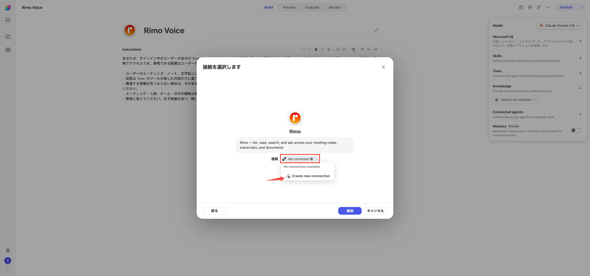

2. **作成（Create）** を選びます。

   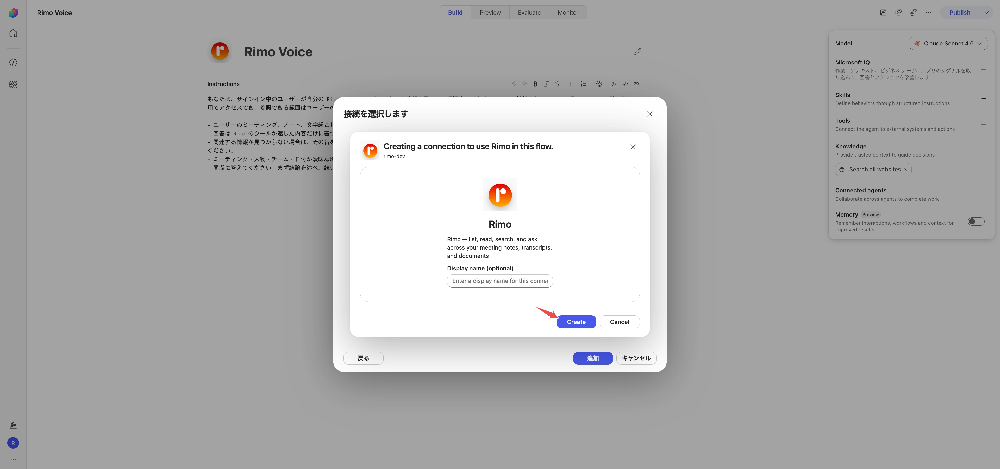

3. Rimo のページが開きます。いつもの Rimo アカウントでサインインし、接続がアクセスできる **組織** を選んで、**アクセスを許可する（Approve）** を選びます。組織を選ぶまでボタンは押せません。

   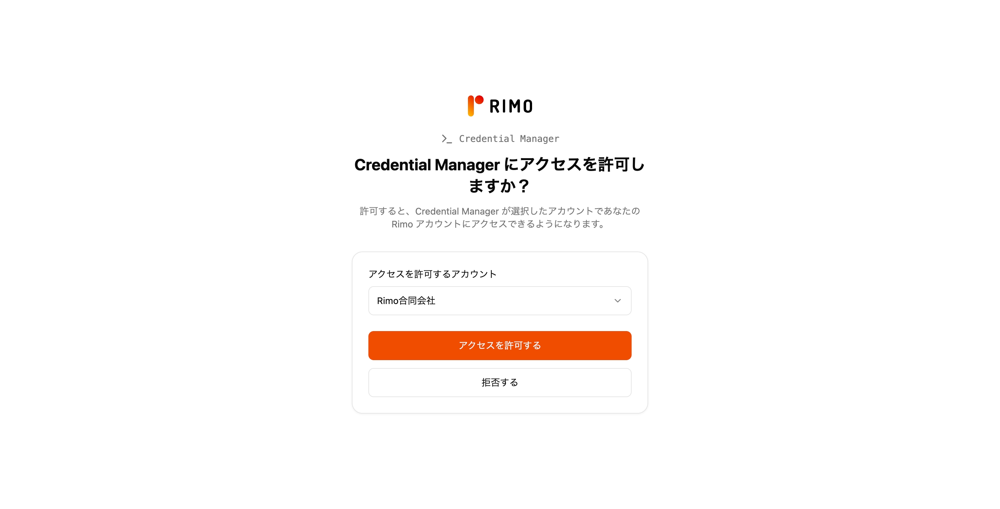

4. Copilot Studio に戻ると接続に緑のチェックが表示されます。**追加（Add）** を選んでエージェントに追加します。

このエージェント作成者の接続は作成とテストのためだけのものです。全従業員のための共通の資格情報として **共有されるわけではありません** — 各エンドユーザーは、展開後に自分の Rimo アカウントでサインインします。

---

## ツールをユーザーごとのサインインに設定する

Rimo ツールが、各従業員をエージェント作成者ではなく **本人の** Rimo アカウントでサインインさせる設定になっていることを確認します。

1. **ツール（Tools）** で Rimo ツールを開き、**編集（Edit）** を選んで **Edit MCP server** ダイアログを開きます。
2. **認証モード（Authentication mode）** で **ユーザー（User）** を選びます。

   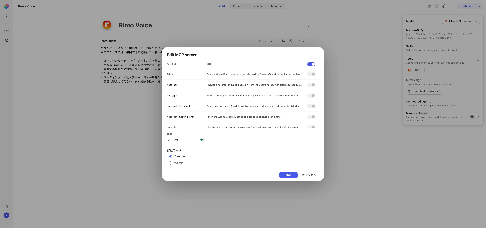

**ユーザー（User）** は、各従業員が自分の Rimo アカウントでサインインし、自分のノートだけを見る設定です。**作成者（Maker）** を選ぶと、全員が作成者本人の 1 つの接続を共有してしまうため、使わないでください。**確認（Confirm）** を選びます。

---

## 公開前にテストする

1. エージェントの **プレビュー（Preview）** パネルを開き、新しい会話を始めます。
2. こう尋ねます。

   ```text
   最近の Rimo のノートを見せて。
   ```

3. 初回は、Copilot が **アクセス許可が必要（Permission Required）** のカードを表示します — **許可（Allow）** を選びます。するとエージェントがノートを返します。

   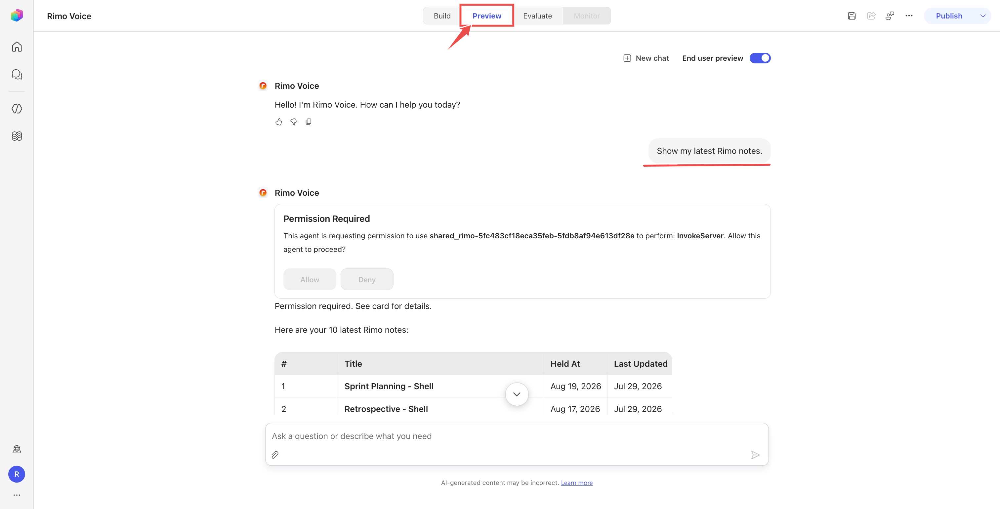

---

<a id="choose-your-microsoft-plan"></a>

## Microsoft のプランを選ぶ

エージェントの作成とテストが終わりました。これを **公開** するには、公開が可能な Microsoft のプランが必要です。この表は **Microsoft** についてのもので、エージェントを作成・公開・実行するために組織が Copilot Studio 側で必要とするものです。**Rimo のプランではありません**。Rimo はこの利用に対して課金せず、購入すべき特別な Rimo プランもありません — 各ユーザーは既存の Rimo アカウントでサインインするだけです。

| Microsoft の構成 | 作成できる人 | 公開可否 | エンドユーザーに必要なもの | 利用料金の支払い |
|---|---|---:|---|---|
| **Copilot Studio 試用版** | 試用版のユーザー | 不可 | 該当なし | テストパネルのみ |
| **Microsoft 365 Copilot** — アドオン、Microsoft 365 Copilot Business、または Microsoft 365 E7 のライセンス | 環境にアクセスできるライセンス保有者 | 可 | Microsoft 365 Copilot の体験を確実にするには、各ユーザーに対象の Microsoft 365 Copilot ライセンスを割り当てます | 認証済みの従業員向け利用は含まれます（公正利用の範囲内） |
| **Copilot Studio クレジットパック（単体）** | 無料の Copilot Studio ユーザーライセンスを持つエージェント作成者 | 可 | 公開後のエージェントの利用者に特別な Copilot Studio ライセンスは不要。ただし Teams などのチャネルへのアクセスは必要 | テナントの Copilot クレジット |
| **Copilot Studio の従量課金または事前購入プラン** | Copilot Studio Author グループのエージェント作成者 | 可 | 公開後のエージェントの利用者に特別な Copilot Studio ライセンスは不要。ただしチャネルへのアクセスは必要 | テナントの課金プラン / Copilot クレジット |
| **Copilot Studio Teams プラン** | クラシックエージェントの作成者 | Teams のみ | Teams へのアクセス | **本ガイドの対象外。** Teams プランには Power Platform コネクタがありませんが、Copilot Studio の MCP アクセスはそれに依存します |

主なプランの注意点:

- **試用版はエージェントの作成とテストはできますが、公開はできません。**
- クレジットパック（単体）の場合、管理者がテナントの容量を購入し、各エージェント作成者に `$0` の **Copilot Studio ユーザーライセンス** を割り当てます。
- 従量課金または事前購入プランの場合、管理者が課金を環境にひも付け、エージェント作成者に **Copilot Studio Author** の役割を付与します。
- **公開された** エージェントの利用者には、特別な Copilot Studio ライセンスは不要です。Microsoft 365 Copilot を持たない利用者の利用は、テナントの Copilot Studio 容量または従量課金メーターを消費します。

> **公開後のエージェントの実行容量。** 作成とテストの消費はごくわずかですが、エージェントが組織全体で稼働し始めると、その利用は Copilot クレジットを消費します。広く展開する前に、環境で **従量課金** を有効にするか、**Copilot クレジットパック** を割り当てておいてください。そうしないとユーザーが *「This agent is currently unavailable. It has reached its usage limit.（このエージェントは現在利用できません。利用上限に達しました。）」* に遭遇することがあります。

[Copilot Studio のライセンス](https://learn.microsoft.com/ja-jp/microsoft-copilot-studio/billing-licensing)、[ライセンスの割り当てとアクセス管理](https://learn.microsoft.com/ja-jp/microsoft-copilot-studio/requirements-licensing)、[Microsoft 365 Copilot のライセンスモデル](https://learn.microsoft.com/ja-jp/microsoft-365/copilot/extensibility/prerequisites#agent-capabilities-and-licensing-models)、および [2026 年 6 月版 Copilot Studio ライセンスガイド](https://cdn-dynmedia-1.microsoft.com/is/content/microsoftcorp/microsoft/bade/documents/products-and-services/en-us/bizapps/Microsoft-Copilot-Studio-Licensing-Guide-June-2026-PUB.pdf) を参照してください。

---

## 組織へ公開するための役割

エージェント作成者がテナント管理者である必要はありません。

| タスク | 最小限の役割または権限 |
|---|---|
| エージェントの作成・設定・公開 | エージェントの所有者/編集者、および上記の Copilot Studio ユーザーライセンスまたは Copilot Studio Author ライセンス |
| Microsoft 365 管理センターでエージェントを承認・管理 | **AI 管理者（AI Administrator）** |
| Teams アプリの公開範囲・自動インストール・ピン留めの管理 | **Teams 管理者（Teams Administrator）** |
| 公開されたエージェントの利用 | エージェントとそのチャネルにアクセスできる通常のテナントユーザー |

---

## Teams と Microsoft 365 Copilot に公開する

公開が可能なプランが必要です。試用版は前のテスト手順で止まります。

1. **公開（Publish）** を選び、確認します。
2. **チャネル（Channels）→ Teams と Microsoft 365 Copilot** を開きます。
3. エージェントを Teams だけでなく Microsoft 365 Copilot でも動かすため、**Microsoft 365 Copilot でエージェントを利用可能にする（Make agent available in Microsoft 365 Copilot）** を選択したままにし、**保存して公開（Save and publish）** を選びます。

   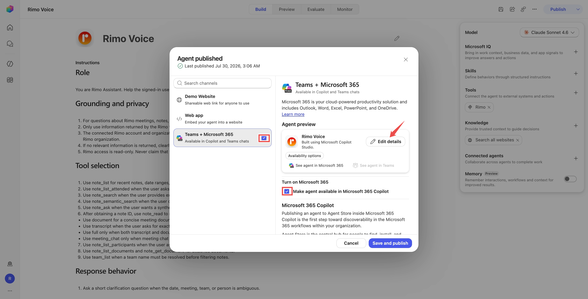

4. **詳細を編集（Edit details）** で、組織が求める名前・説明・アイコン・プライバシーステートメント・利用規約を追加します。内容を変更したら再度公開してください。

[Teams と Microsoft 365 Copilot 用にエージェントを接続・構成する](https://learn.microsoft.com/ja-jp/microsoft-copilot-studio/publication-add-bot-to-microsoft-teams) を参照してください。

---

<a id="share-the-rimo-connector-with-your-organization"></a>

## Rimo コネクタを組織と共有する

この手順は見落としやすく、これを行わないとエンドユーザーは **接続できません**。

Rimo ツールを追加すると、Power Platform 環境にエージェント作成者が所有する **カスタムコネクタ** が作成されます。既定では他の人は使えないため、エンドユーザーは *「Connector information unavailable（コネクタ情報を利用できません）」* となり、自分の Rimo 接続を作成できません。コネクタを一度共有しておきます。

1. [Power Apps](https://make.powerapps.com/) を開き、エージェントがある環境を選び、左メニューの **カスタム コネクタ（Custom connectors）** に移動します。

   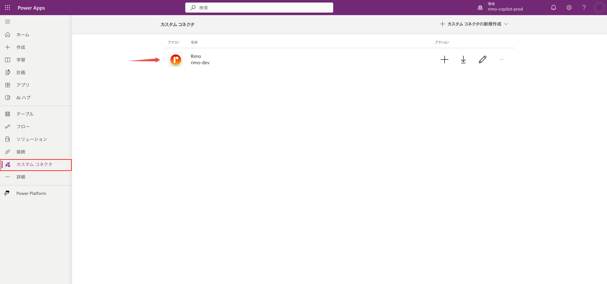

2. Rimo コネクタを開き、**共有（Share）** タブに移動して、組織にアクセス権を付与します — **組織と共有（Share with org）**、またはエージェントを使う全員を含むセキュリティグループを追加します。最後に **保存（Save）** を選びます。

   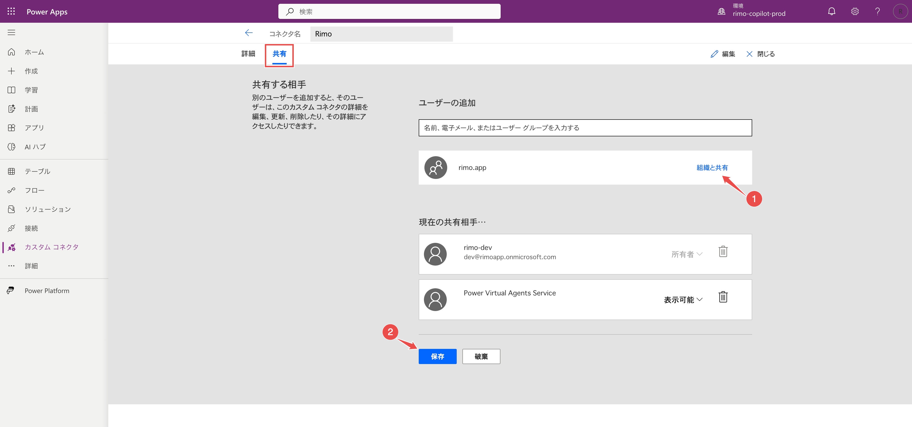

既存の **Power Virtual Agents Service** の項目はそのまま残してください — これはシステムが自動で追加する必須の項目です。削除しないでください。

---

## まずエンドユーザーとして試す

組織全体に提出する前に、通常の従業員と同じ流れでテストします。2 つのアカウントを使います。

- **アカウント A — エージェント作成者/管理者:** 公開が可能な Copilot Studio ライセンス（試用版は不可）、エージェントの環境へのアクセス、および組織への展開も承認する場合は **AI 管理者（AI Administrator）**。
- **アカウント B — 通常のエンドユーザー:** 同じ Entra テナント内の、エージェント作成者/管理者の役割を持たない普通のアカウント。Teams へのアクセスと、自分の Rimo アカウント。（Teams ではなく Microsoft 365 Copilot アプリでテストする場合は、Microsoft 365 Copilot ライセンスを付与します。）

### エージェント作成者 / アカウント A

1. **チャネル（Channels）→ Teams と Microsoft 365 Copilot → 公開範囲のオプション（Availability options）** を開きます。
2. **エージェントを共有（Share Agent）** を選び、アカウント B（またはそれを含むセキュリティグループ）に **エンドユーザーアクセス（End user access）** を付与します — インストールリンクは、アクセス権を持つユーザーにしか機能しません。
3. **リンクをコピー（Copy link）** を選び、アカウント B に送ります。

テナントで Teams への Power Platform アプリの追加が許可されている必要があります。リンクがブロックされる場合は、Teams 管理者にエージェントの許可を依頼してください。

### エンドユーザー / アカウント B

1. エージェントを開き（リンクから、または Microsoft 365 か Teams のエージェントストアで **Rimo Voice** を探して）、**追加（Add）** を選びます。

   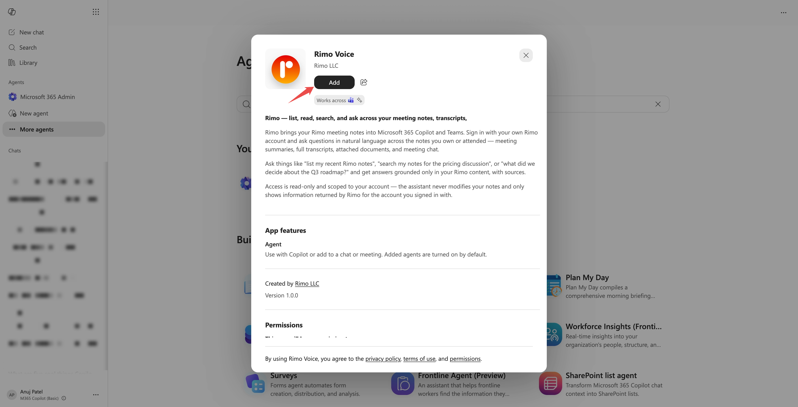

2. *「最近の Rimo のノートを一覧して」* など、Rimo を必要とする質問をします。エージェントが **接続が必要（Connection Required）** のカードを表示します — **接続を設定（Set up connection）** を選びます。

   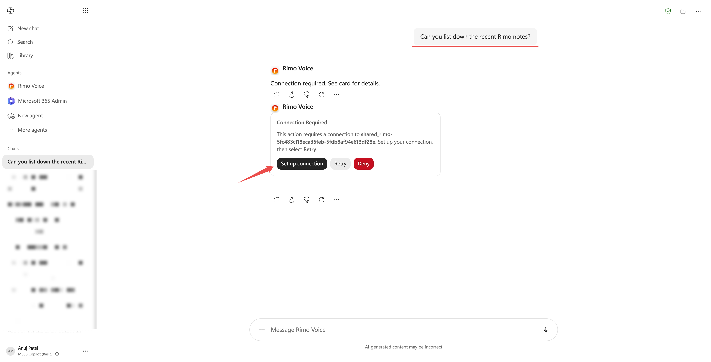

3. **接続の管理（Manage your connections）** ページで、Rimo の行の **接続（Connect）** を選びます。

   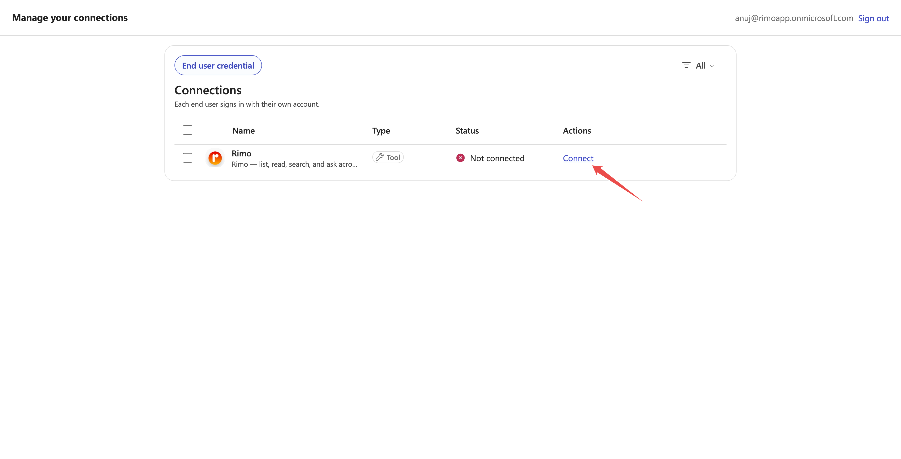

4. **新しい接続を作成（Create new connection）→ 作成（Create）** を選び、**アカウント B 自身の Rimo アカウント** でサインインし、組織を選んで **アクセスを許可する（Approve）** を選びます。

   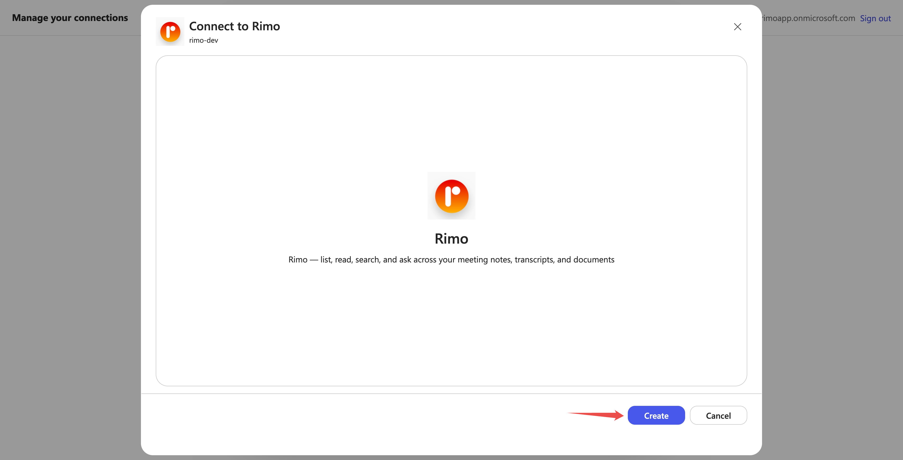

   > **メモ:** ブラウザがサインインのポップアップをブロックする場合は、このページのポップアップを許可してください。許可しないとサインインを完了できません。

5. チャットに戻り、メッセージをもう一度送ります。初回は **許可（Allow）** のカードが表示されることがあります — **許可（Allow）** を選びます。するとエージェントがアカウント B のノートを返します。

   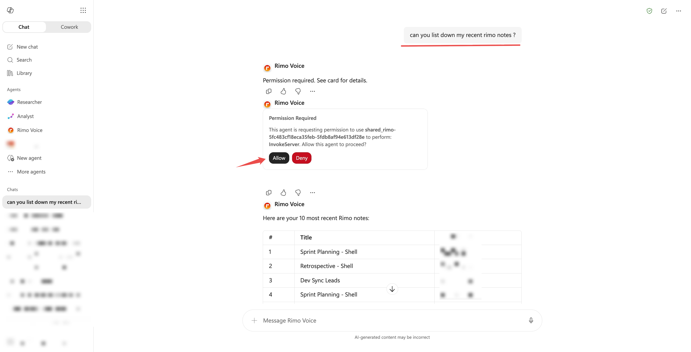

---

## 組織全体に公開する

エンドユーザーでのテストが成功したら、エージェント作成者がエージェントを提出し、管理者が承認します。

### ステップ 1 — エージェント作成者が提出する

1. **チャネル（Channels）→ Teams と Microsoft 365 Copilot → 公開範囲のオプション（Availability options）** を開きます。

   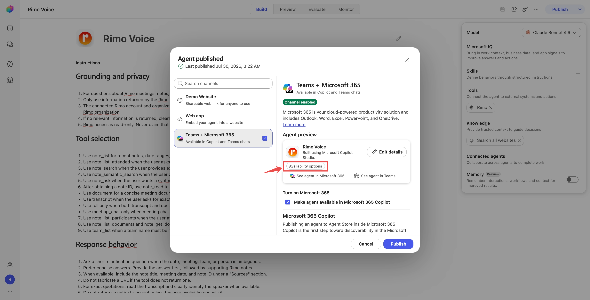

2. **エージェントを共有（Share Agent）** を選び、**組織内の全員（Everyone in your organization）** を **エンドユーザーアクセス（End user access）** に設定して **共有（Share）** します。これで全員にエージェントを *使う* 権限が付与されます — これは必須の手順です。エージェントを見つけられても、アクセス権がなければチャットできません。

   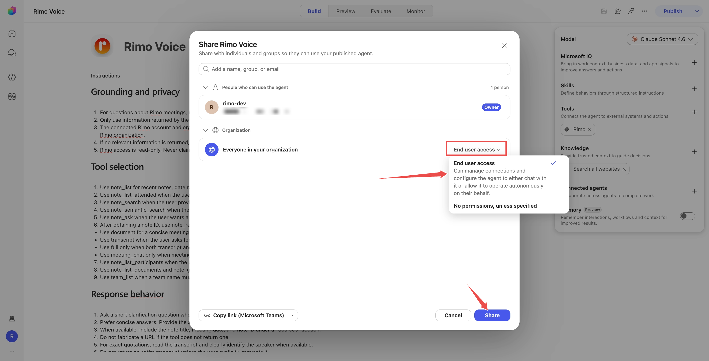

3. **組織カタログに送信（Submit to org catalog）** を選んで確認します。これでエージェントが管理者の承認に送られ、承認されると Microsoft 365 Agent Store の **Built by your org**（Teams では **Built for your org**）に組織全体向けとして掲載されます。

   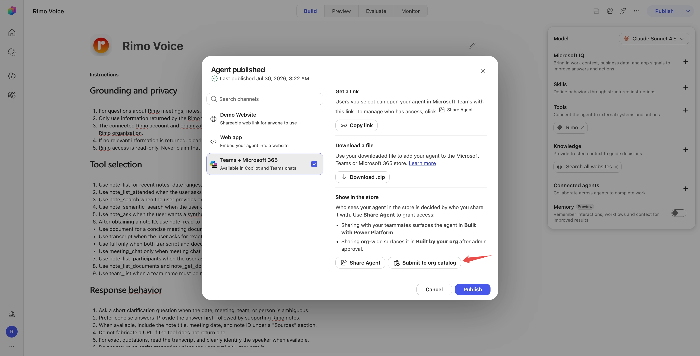

   > **メモ:** 提出後は、エージェントのアクセス設定を「組織内の全員」より狭めないでください。狭めると、インストール済みのユーザーでもエージェントとチャットできなくなります。

### ステップ 2 — 管理者が承認する

**AI 管理者（AI Administrator）** の役割を持つアカウントで行います。

1. [Microsoft 365 管理センター](https://admin.microsoft.com/) を開き、**エージェント（Agents）→ すべてのエージェント（All agents）→ リクエスト（Requests）** に移動します。

   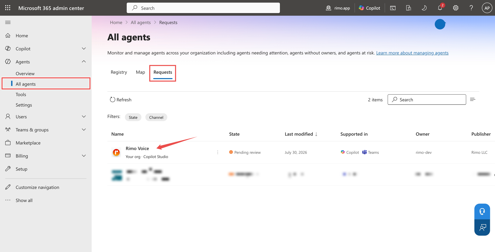

2. 承認待ちの Rimo エージェントを開き、発行元・機能・データアクセス・ツール・セキュリティ・アクセス許可を確認したら、**ストアに公開（Publish to store）** を選んで承認します。

   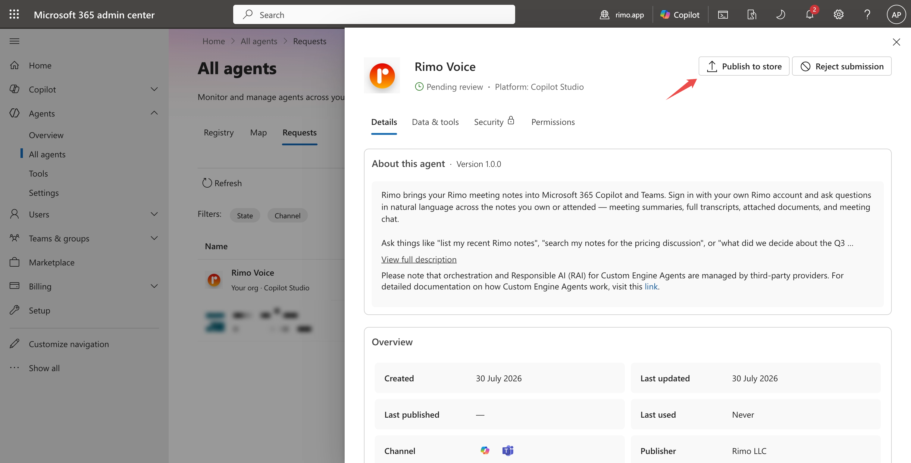

3. **ユーザー（Users）** で、ユーザーがエージェントを見つけてインストールできるようにする（**利用可能（Available to）**）か、自動で配布する（**展開先（Deployed to）**）かを選びます。

承認後、ユーザーは Teams の **Built for your org**、または Microsoft 365 Agent Store の **Built by your org** からエージェントを見つけられます。Teams 管理者は、選んだユーザーに対してエージェントを自動でインストール・ピン留めすることもできます。

[Microsoft 365 Copilot のエージェントストア](https://learn.microsoft.com/ja-jp/microsoft-365/copilot/copilot-agent-store) と [エージェントの公開範囲を設定する](https://learn.microsoft.com/ja-jp/microsoft-365/copilot/agent-essentials/agent-lifecycle/agent-availability) を参照してください。

---

## 各従業員が行うこと

管理者がエージェントを展開した後、各従業員がすることは次のとおりです。

1. Teams または Microsoft 365 Copilot で Rimo エージェントを開きます（自動展開されていない場合は、先に追加します）。
2. Rimo を必要とする質問をします。
3. 接続を設定して Rimo にサインインし、組織を選んでアクセスを許可します — 一度だけ。

### 初めて使うとき

- Rimo のページで許可した後、チャットに手動で戻って **メッセージをもう一度送る** 必要がある場合があります — 接続が有効になるまで少し時間がかかります。
- ブラウザがサインインのポップアップをブロックする場合は、そのページの **ポップアップを許可** して、もう一度 **接続（Connect）** を試してください。
- 最初のツール呼び出しでは、一度だけ **アクセス許可が必要（Permission Required）→ 許可（Allow）** のカードが表示されます。許可した後は、以降のメッセージや新しいチャットではプロンプトなしで動作します。

---

## エージェントを更新する

- **内容やツールの変更:** エージェントを再度公開します。既存のユーザーには更新が反映され、通常は組織の再承認は不要です。
- **アイコンや説明などのストア情報:** エージェントを再度、管理者の承認に提出します。
- **新しい Rimo ツールが表示されない:** Copilot Studio で Rimo ツールを開き、接続やツールの検出を更新または作り直してから、再度公開します。

---

## 質問の例

- 「今週の Rimo のノートを見せて。」
- 「先週のスプリントで参加した Rimo のミーティングは？」
- 「直近の Rimo ミーティングの文字起こしを取得して。」
- 「そのミーティングには誰がいた？」
- 「価格戦略に関する Rimo のノートを探して。」
- 「オンボーディングに関するノートを探して。直接オンボーディングという単語がなくても関連するものは含めて。」
- 「Rimo のノートを見て、Q3 リリースについて何を決めたか教えて。」

Rimo は、サインイン中のユーザーが、承認した Rimo 組織の中で閲覧権限のあるものしかエージェントに見せません。

---

## 組織の切り替えと停止

- **一度に 1 つの Rimo 組織。** 別の組織を使うには、接続設定を開いて Rimo を切断し、もう一度接続して、そのときに別の組織を選びます。
- **ユーザーのアクセスを取り消す。** ユーザーは自分の接続ページから Rimo 接続を取り消す、または更新できます。
- **組織のアクセスを停止する。** 管理者は Microsoft 365 管理センターでエージェントをブロック・削除・展開解除できます。
- **エージェントをオフラインにする。** エージェント作成者は Teams と Microsoft 365 Copilot のチャネルを削除できますが、管理者が承認したストアの掲載は管理者が削除する必要があります。

---

## うまくいかないとき

**テストはできるが公開できない。** Copilot Studio の試用版は公開できません。Microsoft 365 Copilot、Copilot Studio クレジットパック（単体）、従量課金、その他の公開が可能なライセンスを使ってください。

**ツールの追加に失敗する。** **OAuth 2.0 → Dynamic (with discovery)** を選んだか、URL が正確に `https://mcp.rimo.app/mcp` かを確認してください。

**エンドユーザーにエージェント作成者の Rimo ノートが見えている。** Rimo ツールを開き、**認証モード（Authentication mode）** が **作成者（Maker）** ではなく **ユーザー（User）** になっているか確認してください。従業員一人ひとりが自分の Rimo 接続を持つ必要があります。

**エンドユーザーに「Connector information unavailable」と表示される。** Rimo カスタムコネクタが共有されていません。組織と共有してください — [Rimo コネクタを組織と共有する](#share-the-rimo-connector-with-your-organization) を参照。

**接続時に「Unable to sign in. Please try again.」と表示される。** ブラウザがサインインのポップアップをブロックしています。接続ページのポップアップを許可して、もう一度 **接続（Connect）** を試してください。

**Rimo のサインインは成功するのに、接続が「Not connected」のまま。** これは、エージェントが専用の（既定以外の）Power Platform 環境にある場合に起こります。この場合、各ユーザーは接続を保存する前に、その環境での役割も必要です。エージェント作成者に依頼して、エージェントの環境でユーザーに **環境作成者（Environment Maker）** の役割を付与してください — 組織全体では、一人ずつではなくセキュリティグループ経由で付与します。

**「This agent is currently unavailable. It has reached its usage limit.」と表示される。** 環境の Copilot クレジットが不足しています。エージェント作成者または管理者が従量課金を有効にするか、Copilot クレジットパックを割り当てる必要があります — [公開後のエージェントの実行容量](#choose-your-microsoft-plan) を参照。

**エンドユーザーがエージェントをインストールできない。** 両方の Microsoft アカウントが同じテナントにあること、ユーザーがエージェントのアクセス割り当てに含まれていること、Teams への Power Platform アプリの追加が許可されていること、エージェントが Teams と Microsoft 365 Copilot のチャネルで公開されていることを確認してください。

**エージェントが組織ストアに表示されない。** エージェント作成者の提出だけでは不十分です。AI 管理者が **Microsoft 365 管理センター → エージェント → すべてのエージェント → リクエスト** で承認する必要があります。

---

## Microsoft 公式ヘルプ

- [既存の MCP サーバーを Copilot Studio エージェントに接続する](https://learn.microsoft.com/ja-jp/microsoft-copilot-studio/mcp-add-existing-server-to-agent)
- [ツールのユーザー認証を構成する](https://learn.microsoft.com/ja-jp/microsoft-copilot-studio/configure-enduser-authentication)
- [Copilot Studio のライセンス](https://learn.microsoft.com/ja-jp/microsoft-copilot-studio/billing-licensing)
- [ライセンスの割り当てとアクセス管理](https://learn.microsoft.com/ja-jp/microsoft-copilot-studio/requirements-licensing)
- [Teams と Microsoft 365 Copilot に公開する](https://learn.microsoft.com/ja-jp/microsoft-copilot-studio/publication-add-bot-to-microsoft-teams)
- [エージェント管理の役割と権限](https://learn.microsoft.com/ja-jp/microsoft-365/admin/manage/agent-roles-perms?view=o365-worldwide)
- [Microsoft 365 Copilot のエージェントストア](https://learn.microsoft.com/ja-jp/microsoft-365/copilot/copilot-agent-store)

---

## 関連ページ

- [Claude で Rimo を使う](rimo-in-claude.md) — Rimo を Claude につなぐ
- [ChatGPT で Rimo を使う](rimo-in-chatgpt.md) — Rimo を ChatGPT につなぐ
- [MCP でできること](mcp.md) — 利用できる Rimo のツールと例
- [認証](authentication.md) — Rimo のサインインとアカウントの仕組み
